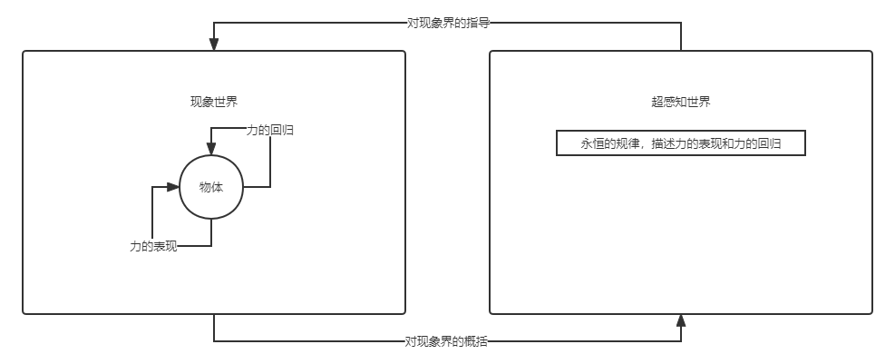
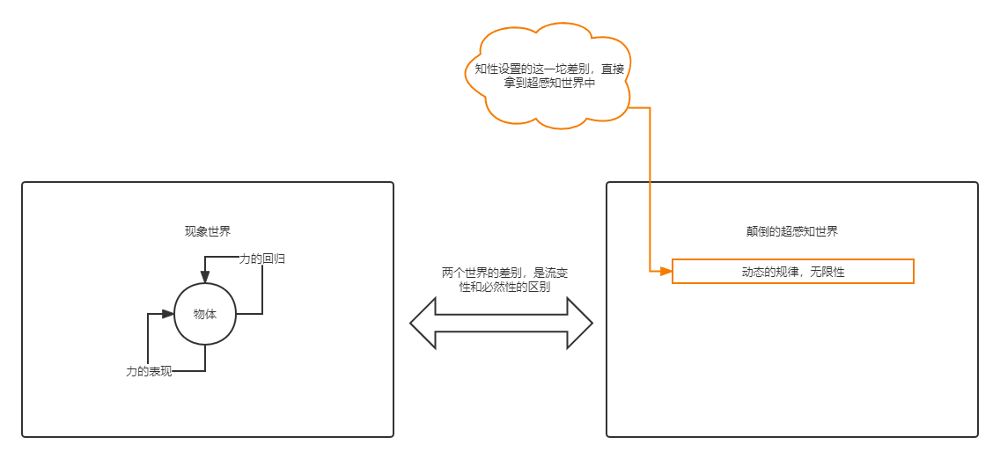

# 《精神现象学》意识篇

## 一、感性

### 基本场域

最初，我们的话题只有 3 部分：

1. 我。
2. 物。
3. （我对物的）认识活动。

### 感性辩证法

感性辩证法主要是处理这一个矛盾：

1. 正面：感性事物本身是唯一的。
2. 反面：认识活动的意谓无法直接触及这个唯一。
3. 上升：认识活动本身就是在“共相”的普遍性层次上的，由此，“感性”上升到“知觉”。

### 论述展开

我们最开始认为，“物”是真实的、本质的，而“我”和“认识活动”和是虚假的。“物”没有“我”和“认识活动”也是可以存在的，而“我”和“认识活动”是可以存在，也可以不存在的。因此，我们需要调查，在“物”中有什么样的真理性。

首先，我们要问的问题是，“这一个物是什么”。物可以在两个形式上展开：“这里”和“这时”。因此，这里我们又引入了另一个预设来充实我们的论证：

预设 1.1：“这一个”可以按照“这里”和“这时”展开。

然后，我们可以考虑这时是什么。这时我们可以首先回答“这时是夜晚”。然而这句话不是真理，当白天的时候这句话就为假了。同理“这里”也是一样，“这里”可能是树，也可能是房子，“这里”也是不确定的，没有真理性。

因此，“这一个”、“这里”、“这时”的结构实际上是（以下只按照“这时”来举例子考察）： 

1. “这时”不是“白天”。 
2. “这时”不是“黑夜”。 
3. “这时”可以是“白天”，也可以是“黑夜”。

“这里”、“这一个”也是同理。

我们把类似于“这一个”、“这里”、“这时”这种结构，叫做“共相”。

接下来，我们可以简单考察共相。我们把“这时是夜晚”这句话简化一下：如果我们只说“这时”，把“是夜晚”去掉，我们考察“这时”，“这时”好像是可以持存的，是个真理，只是它可以指代的对象可能会变化，但是“这时”本身不会变。

因此，我们得到一个结论：

结论 1.1：“感性的物”（这一个树、这一个房子）本身没有真理性。“这一个”、“这里”、“这时”是共相。“这一个”、“这里”、“这时”是本质，是真理。

通俗点理解，就是没有什么物是可以永恒、无条件存在的。

此时，我们继续考察，如果“物”没有确定性（真理），那么真理就在“我”这里。我们可以说“我感受到了这里是树”、“我感受到了这时是夜晚”，由此来固定视角，不让物自己随着时间和空间变化。这样我们提出了“我感受到了这里是树”、“我感受到了这时是夜晚”，为这种论述是有真理性，而上面我们说“这时变成了白天”，其实是“另一个我感受到了这时变成了白天”。因此“一个我感受到这时是夜晚”和“另一个我感受到这时是白天”，这两个论证之间，并不冲突，由“不同的我”区分开了，并且都是一直正确的。

然而，我们考虑“这一个我”、“另一个我”，就能知道，“我”本身也没有了真理性。而按照上面关于“这一个”的进展，“我”可以指很多个我，但是并不是其中任何一个我，和“这一个”的结构完全一样。因此，我们可以说“我”也是共相。我们得到另外一个结论：

结论 1.2：“每一个我”（看见树的我，夜晚的我）没有真理性，“我”是共相。“我”是本质，是真理。

至此，我们还可以有最后的挣扎：“我指着这一个物，这个独一无二的物，我们的感性确定性本身有真理性”。然而，“这一个物”其实本身就蕴含了关于“这一个”、“这里”、“这时”的定义，当你指出“这一块空间是我的独一无二的一张纸”的时候，你已经人为的把空间分割开了。我们可以指着旁边的笔，来追问“那这一个是什么”。其实你早就知道“这一个”可以代表多个物了，因此你对“独一无二的一张纸”的指明动作，仍然已经预设了“这一个”的共相。

因此，我们可以得到最后的结论：

结论 1.3：“对感性事物的认识本身没有真理性，是通过“共相”中介过的。

至此，我们可以放弃“对感性事物的认识本身”的考察，到达更高的思维层次——知觉。

## 二、知觉

### 基本场域

在这个层次，我们对物的认知，就不是仅仅考察这个物本身了。我们是通过共相的角度来考察物。因此，我们可以引入另一个预设来考察这样“共相视角下的物”：

预设 2.1：物可以按照不同的共相特质被规定。即，物是由不同的共相特质组成的共同媒介。

因此，引入了特质之后，我们观察物可以这样来看：

1. 对于“糖”这个物来说，它有“甜”、“圆柱体”，等等特质，事物是这些特质的共同媒介。
2. “甜”、“圆柱体”是共相，不是糖独有的，拥有“甜”这个特质的物体，可以有“糖”、“苹果”、“西瓜”，等等。

另外，我们还有另外一个预设：

预设 2.2：特质的关系——有些特质是互相不相关的（“甜”和“圆柱体”），但是有些特质之间是互斥的、对立的（“甜”和“酸”）。

另外，考虑到虽然特质构成了一个物，但是我们还是能区分开每一个物，每一个物都是互相不同的，是独立存在的。因此我们有另一个预设：

预设 2.3：物有排他性、单一性，不依赖其他物而理解。

至此，我们可以讨论知觉层次上的物了。物实际上是这样子的：
​

### 知觉辩证法

知觉辩证法主要是处理这一个矛盾：

1. 正面：物的本质是排他性、单一性。
2. 反面：物的本质是多个共相特质的共同媒介。
3. 上升：物的本质是两者都不是，而是单一性和共同媒介的互相展开作用。由此，“知觉”上升到“知性”。

### 论述展开

首先我们要明白，为什么“排他的单一性”和“共相特质的共同媒介”有矛盾。我们先从“共同媒介”的理解角度出发：

一、物是多个共相特质的共同媒介，所以当我认识这个物的每一个特性的时候，我必须超出这个物，在普遍的层次来理解，我说糖是圆柱体，然而我对圆柱体这个特质的理解，实际上是我在人生中观察了无数个物，总结出来的圆柱体的共相。因此，这个物无法成为排他性的单一体：它的每一个特质都依赖了其他物来规定。
​

二、因此，我们不能把某个物当成对象来考察。我们可以把所有物聚合成一个连续体，是这个世界所有的物构成的“道”、“一”、“大全”，这个物拥有我们全部的规定性的特质。这样“普遍”对“普遍”，就没有问题了。然而，这违反了预设 2.2，即特质的矛盾性。这个“一”不能既是“甜”又是“酸”，这两个特质是互斥的。因此“一”的构想是不对的。
​

三、因此，我们还是要把这个“一”拆成不同多个物。此时有 2 种拆法：

* 如果拆成每一个物都是共相特质的共同媒介，那么我们回到了 1。这个物还是要超出自己来理解，由此无限循环。
* 如果拆成每一个物都是非共相特质的共同媒介，即我对的“甜”的理解，仅仅局限于“这一个糖的甜”。那么实际上我们回到了感性的认识。回到了第一章，感性。我们可以从第一章的讨论中，得知，“这个糖的甜”还是预设了“甜”这个共相。因此，“这个糖的甜”还是会上升到“普遍的甜”，由此我们又回到了每一个物都是共相特质的共同媒介，那么我们回到了 1。这个物还是要超出自己来理解，由此无限循环。
​

因此，我们得到了第一个结论：

结论 2.1：预设 2.1 和 2.3 是矛盾的。即，物的两个理解：共相特质的共同媒介和排他性的单一体是互相矛盾的。

然而，我们发现，对物的认识，都是有意识参与的。当物的这两方面本质出现矛盾的时候，我们认为，是意识这边自己欺骗了自己。因此，我们还有 2 个进路：

1. 共同媒介不是物的本质，是意识的活动。
2. 单一性不是物的本质，是意识的活动。

我们先考察 1。很容易说明，当我们认识物的时候，是我的鼻子，嘴，味蕾，手，在感知物，我的感知本来就是分散的感知到物的特质，因此物的多样性本来就是我的意识获取到的，物本身没有多样性。然而，事物现在只有单一性、排他性的空洞内核，没有任何特质。我们发现，我们感觉到的“甜”、“圆柱体”，仍然也是这个物固有的属性，物有，我们才能感知到。因此，我们还是认识到了到在物那一侧存在着“特质的并且”。因此，物必须有共同媒介这个特质。并且物就是通过这些特质，而排他的、成为单一体的。

我们再考察 2。即，单一性不是物的本质，是意识的活动。那么物现在是共同媒介，而把这些媒介统一起来的组成一个排他性的一，这个“统一性”，是意识的活动。然而，在物那里，共相组成的特质，仍然是漠不相关的。但是对于“糖”这个物而言，它本质是“甜”、“圆柱体”的共同媒介，他们还是按照物某种特定的内在关联绑在一起的，并不是随便绑的。这种内在关联其实就是物的单一性。因此，物必须有单一体这个特质。

因此，我们得到结论：

结论 2.2：把预设 2.1 和 2.3，即共同媒介和排他性的一，分别归于意识和对象两侧来解决矛盾，是行不通的。

此时，我们已经知道，“单一体”和“共同媒介”是都是物的内部矛盾。为了解决这个矛盾，意识决定把内部矛盾分配给不同物上，变成外部矛盾。也就是说，物有两种规定性：

1. 物有本质规定性。物首先是单一的、排他的，他的本质不和其他物发生联系，只和自己发生关联，并且根据这个本质规定性，可以和其他物分开。
2. 物有其他非本质的规定性，也就是普遍的特质。物和其他物，只是根据那些非本质的特质发生关联，和自己无关。

这样，我们可以说，“糖”和“药丸”本质上就是不一样的，而当我们把它们放在一块的时候，能发现其他非本质的、不是决定性的特质之间的联系：糖和药丸都是立方体，但是他们在味道上互相排斥，这些关联，都不影响他们的本质规定性。当我们对糖本身进行理解的时候，我们只有对它关联的本质理解，而不需要进一步上升。而我们上升到普遍特质理解的时候，糖和药丸也能根据这个本质特性来保证互相的排他的单一性。就可以避免物的内部矛盾了。
​

然而我们仔细考察 1，就会发现其实是有问题的。因为这种本质规定性，其实就是说“这个物和其他都不同”。展开来说，就是“物 A 的本质，是和物 B、C 都不同”。可以看到，其实也是依赖他物的，即“物的本质依赖他物”，而这是我们不能接受的——我们无法说“糖”是什么，而只能说“糖”不是“醋”、不是“苹果”，“糖”不是“糖之外的任何东西”，而这相当于什么都没说。

因此，我们可以得到结论：

结论 2.3：把物的内在矛盾分摊给其他物，把物本身的单一性作为不依赖其他物的本质设定，也是我们无法接受的。单一性（自为）和共同媒介（为他）是单个物的基本矛盾。

其实，意识在这里兜兜转转的原因，是因为我们的共相都是有条件的：物不能无条件的拥有这个共相作为本质，即“糖”不能拿“甜”这个共相作为本质，因为“甜”是有条件的，是受限的，“醋”首先就不是“甜”的。

因此，我们应该寻找一个“无条件的共相”，来作为“物”的本质，从而生发出这一系列矛盾。而这个“无条件的共相”、“每个物都拥有的共相”，其实就是我们上面所说的那个“运动的矛盾”。

至此，我们必须认识到，物的本质并不是什么单一性，也不是共同媒介，而是这个“运动的矛盾”，是我们上面所说的，从个体，由于特质是共相的原因到连续体，再由于特质互相排斥的原因把连续体拆成个体的矛盾的运动。至此，我们达到了考察“无条件共相”的意识层次，即“知性”。

## 三、知性

### 基本场域

在这个层次，我们说物的本质，既不是单一体，也不是共同媒介，而是“运动的矛盾”。我们把这个运动的矛盾称为“力”。

对应于知觉章，我们有力的运动的 2 个方面：

1. 力的表现，即物表现为共同媒介。
2. 力的回归（力本身），即物表现为单一体。

### 知性辩证法

知性辩证法主要是处理这一个矛盾：

1. 正面：事物本身存在内核，内核驱动现象界。
2. 反面：意识想认识到这个物的内核究竟是什么。然而意识不断发现，所谓事物的内核，其实一直都是意识的建构。意识不断的求而不得。
3. 上升：事物的内核就是意识本身，意识在事物中认识到了自己，成为了自我意识。由此，“知性”上升到了“自我意识”。

### 论述展开

我们首先考虑，在力的视角，矛盾的运动的过程是：

1. 【力本身】：单一体 A。
2. 【力本身 -> 力的表现】：A 被 B 诱导，发生外化、表现。
3. 【力的表现】：A 此时被诱导的表现了自身，成为多种质料的媒介，可以被意识感知、可以和他物发生作用。
4. 【力的表现 -> 力本身】：A 被诱导着外化的时候，本身也是作为一个他者，和 B 区分开。

如图：
​

然而，此时知性意识到，力和力的表现本质上是互相规定的——当“药丸”去诱导“糖”的时候，我们其实也可以说，是“糖”在诱导“药丸”。也就是说，力的本身是双向的：

1. “力的表现”可以诱导“力本身”表现出来。
2. “力本身”也可以诱导“力的表现”回归为“力本身”。

并且，力的这两种形态，其实只有互相规定，没有任何的现实性，力和力的表现，其实都是意识的活动，是瞬间两个消失的过程。譬如，我们考虑磁力。可以说，在静止的时候，磁铁的磁力是没有表现出来的，就是它自身。而另一个磁铁靠近的时候，力会立刻表现出来，发生作用。并且表现完成一瞬间，力会立刻回到自身，表现立刻消失掉，以维持两个磁铁的独立性。因此，力本身没有任何的实体性，只是意识的“概念”，它们的出现后立刻消失，其实就是意识的想象。

但是，物能表现出来力，并且根据力维持自身的单一性，说明它内部一定有关于力的本质。举例来说，“磁铁”能表现出“磁力”，那么一定有它固有的“磁性”。

因此，我们得出结论：

结论 3.1：力本身和力的表现，都是意识的想象，没有实体性。相应地，物应该存在一个内核，才能让我们察觉到有力本身和力的表现。

因此，物的本质实际上是某个内核。而现象世界所有的这些运动，其实都是这个内核驱动的。因此，我们可以把事物的内核想象成一个“超感知世界”。而我们现在眼前看到的，运动着的世界、物和物之间发生诱导和表现的流变世界，我们可以称之为“现象世界”。而这个内核是我们看不到的，我们只能根据现象界中的现象来认识超感知世界。

因此，我们得到进一步的，关于结论 3.1 的推论：

推论 3.1.1：我们可以把物的内核想象成一个超感知世界，我们无法感知到“超感知世界”，只能通过现象来认识它。

然而，当我们更深刻的剖析【本质、物的内核的实质、超感知世界】中到底有什么（这 3 者在这个语境中是同义词），就会发现，它其实是空洞的。因为意识本身就除了现象什么都感知不到。我们必须推理出这个超感知世界到底有什么。

现在，有了超感知世界，我们可以说，所有的力、力的表现、诱导、被诱导、统一体、媒介，等等，都不用做区分，他们只是普遍的力和力的表现，在现象世界中展示出来的流变的现象，没有原则性的冲突，只是在互相转化、运动。而超感知世界中，有它对应的“内核”。因此，这个“可以解释现象界的流变现象的静态本质”的内核，我们可以称为“规律”（也就是我们原来说的所谓“空洞”的东西）。规律作为一个稳定的、静止的图像，给流变的现象世界的【现象中的特定的物的【力和力的表现如何进行】】提供了指导和蓝图。
​

因此，我们得到了初步的推论：

推论 3.1.2：超感知世界和现象界有一定的区分性。我们感知不到超感知世界，只能推理它的内容。初步地，我们可以认为，超感知世界是静态的规律王国。

现在，我们仔细来考察一下，超感知世界中的规律和现象世界中的现象（力和力的表现）到底有什么区别。

由于超感知世界中的规律，都是从现象界抽象来的，因此我们考虑最基本的现象“磁铁吸引铁”。如果把这个现象作为规律的话，那么超感知世界和现象界也没有区别。

为了有区别，我们必须把这些规律进行“合并”，成为一个真正本质的普遍内核，成为一个最普遍的规律。然而，最普遍的规律什么都说不出来，它仅仅能说“现在的一切都是这样子的”这种空洞的话语。因此，规律王国的规律表现形式应该是：有很多个有差别的规律，每个规律被规定为一个方面（概念），在这个方面，这个规律有自己的法则。

因此，规律有 2 个维度：法则和概念。例如欧姆定律，概念是说电阻本身是个什么东西，而法则是那个 R = U/I 的公式，可以应用到现象界。规律是稳定的，和现象不一样。规律的“欧姆”和“R = U/I”是必然的，不像现象界那样变来变去。

然而，规律并不是必然的：电不必然的被分成阴阳，R 也不必然的和 U、I 有关系。这种分法，其实只是我们意识的活动。而且这种必然性，也只是知性感觉它是必然的，本质上是不必然的。类似于电阻、R = U/I，只是我们主观上对现象的“字面解释”，其实并没有超出现象——它们具有相同的内容、相同的性质：对电的阻碍作用，可以被描述成电压一定，与电流的乘积反比。这种规律本身，和现象还是没有区别。
​

其实，我们上面所说的差别，本质上就是：现象是流变的，规律是静态的。然而这个差别其实并不是规律本身有的。规律其实只是对现象的概括而已，规律并没有必然性、静态性。而知性根据“解释”这个活动，创建了这两个世界的个差别【知性认为规律是必然的、静态的，从而和动态的现象界区分开】，并且通过解释活动取消了这个差别【知性强行用静态的规律解释现象界，说现象界的差别不是本质差别，而背后有真理性的规律作为推手】。这一切只是意识的臆想。

因此，我们得到了推论：

推论 3.1.3：规律和现象本身没有差别。这些差别都是知性人为规定的之间有的差别，是知性人为的设立了一种差别（动态现象抽象为静态规律，并且知性坚持认为静态规律和动态现象有必然性上的差别），然后用解释活动取消了这个差别（静态规律解释动态现象，动态现象背后有静态的规律作为内核）。

现在知性已经意识到自己的参与了。我们在这里可以看到，意识的活动的结构是：设定了（现象界和超感知世界的）差别，然后立刻取消了这个差别。这和我们在最开始认识力的时候的思维模式是一致的：我们发现力和力的表现是相互规定的，我们设置了这两个力的方面，然后两个力的方面瞬间就会消失。力是意识的流变，并不是物的本质。

那么和“意识中的、做概念的力 -> 物质本身的内核”的过程类似地，知性就要把自己的影响拿走，或者说投射到物上面。也就是说，这个知性带我解释活动对应的“首先设置差别然后取消差别”，其实本质上也是规律的一部分，我们得到了“第二个规律”。在这个规律不是静态的：现象界的“流变”，实际上对应了内核界的“绝对差别”、“绝对转化”。因此，我们得到了下一个推论：

推论 3.1.4：现象界的变化实际上也是规律的一部分：规律内在的有知性的解释活动所表达的那种绝对差别、绝对转化。

因此，我们的超感知世界需要引入绝对差别，进化成了“第二个超感知世界”，黑格尔称之为“颠倒的超感知世界”。

在这里，有一个结构性的转变：

1. 对于有一个超感知世界的规律，解释现象世界，是用静态永恒的某一条规律来说明，力和力的表现，背后都有一个统一的内核，两者都是内核的现象。因此，在现象世界看起来矛盾的统一体和共同媒介，在超感知世界，会告诉你他们就是不矛盾的，是等同的，他们背后有一个内核，因此可以直接把这个差别取消（实际上，我们后来知道，这种取消是意识的活动，是“解释”，并没有真正的取消）。
2. 对于有两个超感知世界的规律，解释现象世界，是两个互斥的、互相排他规律本身就是动态应用的、变化的，所以在现象世界，会体现出变化的现象。因此，在现象世界看起来矛盾的统一体和共同媒介，在超感知世界，会告诉你他们的矛盾实际上来源于背后内核的运动展开，从而产生的不同的现象。

如图：
​

此时，我们把这种“第二个规律”称之为“无限性”：

1. 规律自己排斥自己，自我分裂。
2. 被分裂为二的成分，表现为规律中的各个部分，他们都是各个要素，实存的东西。
3. 这些部分的本质是统一性，这些部分之间，互相激励、互相规定，扬弃自己，它们能够意识到，自己存在另一个对立面，并且自己是更大的概念的其中一部分，因而可以和对立面一起回归到了统一体中。

因此，我们最终可以得到结论：

结论 3.2：事物的内核是无限性。
​

进而，当我们的意识把无限性当做对象，用认知活动来考察的时候，也会发现，其实本来超感知世界中的一切，本身只有现象。除了现象以外的其他东西，也和所谓的“力”、“解释”等等这些意识上的建构一样，都是意识的建构。

因此，我们有结论：

结论 3.3：现象背后的整个第二个超感性世界，其实也都是意识的建构。

并且，意识突然发现：

1. 意识自己排斥了自己，自我分裂。
2. 被分裂为二的成分（作为无限性的规律、我本身的意识），在物质那里变成了物的本质，在我这里变成了认识的主体。
3. 我本身突然意识到：作为无限性的规律，其实是我的对立面，它本身就是我自己。是我自己走到了物质内核的背后，走到了超感知世界中。现在，是我自己发现了自己。

如图：
​

因此，我们有最后一个结论：

结论 3.4：事物的内核是意识本身。

由此，意识对于对象的全部认知已经结束。并且，意识最后的对象是它自身，认识到了物最终的本质，其实在自己的意识之中。此时意识已经意识到了自己，因此我们说，这种意识已经达到了“自我意识”的层次。
