# 《精神现象学》理性篇

## 一、理性的确定性

### 理性的发展

在“自我意识”章的最后，苦恼意识完全牺牲了自己的独立性，设置了一个中介和彼岸，这样也是永远到达不了彼岸的。真正的真理，其实是“个别的意识”（此岸）和“不变的意识”（彼岸）的直接统一。

自我意识由此达到了理性。意识明白了【个别的意识自身即是绝对的本质】，它体现为：

1. 意识不需要彼岸。彼岸所代表的纯粹的本质，内在于意识。
2. 意识不是个别性的。意识本身就是普遍的本质。

因此，意识这里得到的结论，其实就是：【我就是真理，我就是一切实在】。

举个例子，在“自我意识”章，意识一直以为“超越性”的存在，不在这个现实的、流变的世界之内。自我意识认为：【人生一定有一个超越性的意义】。但是在现实的、流变的世界中，【人一定会死】。然而，在认识到自己的个别性、现实世界的实在性，以及认识到超越性根本不存在之后，自我意识此时认为：超越性是内在于自己的，自己是普遍性的。那么，【自己就是全世界唯一的确定性，自己死了之后，世界就不存在了】。

现在，自我意识和世界之间的结构是：
​
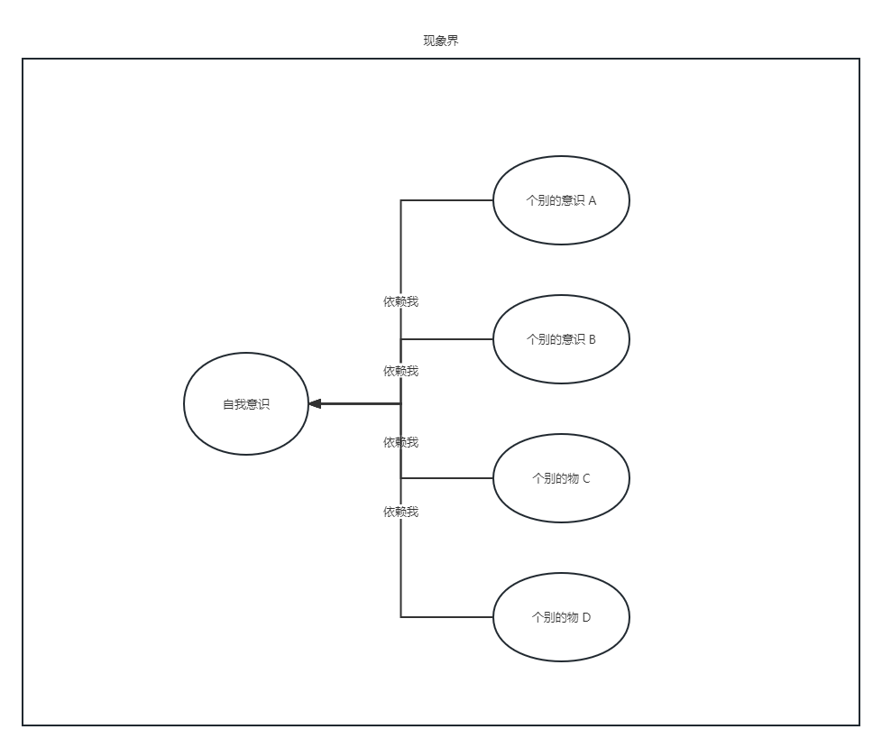

### 唯心主义

因此，这样的意识就是【唯心主义】。

因此，意识现在有了自身的确定性，就不需要在否定世界、否定自然物身上来找确定性。因为意识觉得【自己是一切的实在，是唯一的真理】，而且【自己眼前只有世界】。因此，【世界的持续存在】必然是【以自己为确定性的】。

并且，在眼前的世界中，也不存在其他对象了。【我是唯一的对象】。因为唯心主义在之前的各个环节的运动中已经证明了自己：

1. 他物（自在的一面），已经消失在感性、知觉、知性的运动中，并没有确定性。
2. 生命、其他自我意识（为自我意识而存在的一面），已经消失在主奴意识、斯多葛主义、怀疑主义、分裂的意识的解放斗争（此岸、彼岸的对立）的运动中，并没有确定性。

### 范畴

首先，理性知道【自己就是一切实在】的这个确定性，还只是【纯粹抽象】。它的实在性只是一个【纯粹范畴】。最开始，理性仅仅认为，世界上的那些存在物（他物、生命、其他自我意识），其实和我根本就是一个东西，是【内在的、单纯的统一】。物和我都具有相同的结构、相同的真理性——我本身。

然而，说物和我本身直接相同，就是首先承认了一种差别，然后又说这种差别不是差别（例如，我们说，“我和你是一样的人”——这句话的意思就是说，我和你虽然是两个不同的个体，但是我们的某方面本性是统一的；如果我们是同一个人，我就不用说“我和我是同一个人”这种话了）。这些差别不能视而不见。

因此，在【纯粹范畴】中，我们还要划分出【众多范畴】。来说明这种差别。例如【时空】、【颜色】、【逻辑】，等等。然而，这种对众多范畴的划分，本质上是【不必然】的。很难说出来对范畴划分的道理何在——为什么“时间”、“空间”是范畴？为什么“引力场”不是范畴？还有没有其他范畴？

因此，这种【纯粹范畴】、【众多范畴】等等划分，并不是【能够实现物与我统一的本质】，而只是一些需要【被扬弃的环节】。那么，【能够实现物与我统一的本质】就必须是一种【运动】。

例如：理性对待一个苹果【纯粹范畴】，通过【味道】、【时空】、【颜色】等等【众多范畴】去认识这个苹果，然而【苹果本身不是任何范畴】，【众多范畴】在意识里面，又重新【组装】成苹果这一个概念。

这种理性对物的认知过程，我们叫做【图式】。

因此，上面说的【万物的确定性都依赖我】这句话，对于理性而言，具体来说，是【通过范畴依赖的】：
​
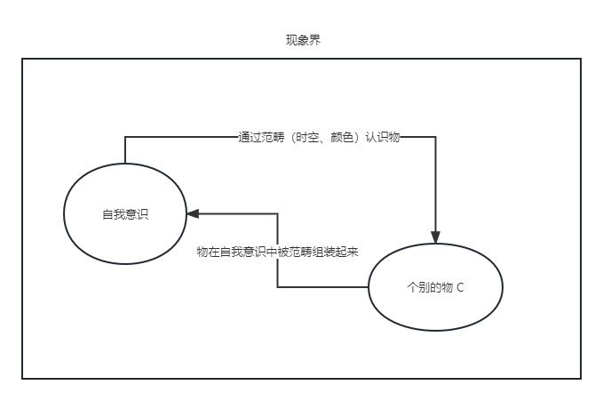

### 知识

因此，理性为了充实空虚的、抽象的的【我就是一切实在】这个真理，就会进行着上述【寻求】。

理性从作为【纯粹范畴】的自身出发，向【对象】过渡；又在【对象】中直观这个过程，将对象作为一个【区别物】予以【扬弃】而【吸收为己有】；并且【宣布】自己为这个【确定性】：【我即是一切实在】。

这种【唯心主义】和【怀疑主义】有两个方面的不同：

1. 怀疑主义对待现实的态度是否定的；唯心主义对待现实的态度是肯定的。
2. 怀疑主义本质上还在追求外在的超越性；唯心主义认为超越性就是自己。

然而，在这种唯心主义中，存在和怀疑主义类似的矛盾：

1. 意识认为自己才是一切实在（也就是说，事物本身是非实在的，是通过范畴被我认识了，我的认识才是实在的）。
2. 物本身就是实在。

因此，这里面有两种真理性和实在性的矛盾。理性存在着【我觉得】和【物的现实】之间的永恒矛盾。因此，在理性和事物之间，就存在这样一种关系：一种【永不安静的寻求】。

## 二、观察的理性

因此，现在意识又重新要认识世界了。但是这和之前不一样。以前，【感性】、【知觉】被我们的意识以寻找确定性为由，直接扬弃掉了。现在，意识已经有【我即是一切实在】的认识了，那么它确信，世界一定是合乎理性和范畴的。意识就要在事物性中寻找自己，寻找一种意识构建的【概念】出来。

理性最开始，仅仅是【揣测】、【一般的知道】实在是属于它的。这种程度的寻找并不是理性的终点，因为它发现【在它财产里还有外来的他物】。因此，理性认为，是自己的认识还不够深刻。因此，理性必须要求将【差别】、【丰富多样的存在】，变成【纯粹属于我的东西】。于是理性就开始了探险。

### 对自然的观察

对自然的观察，里面可以分成：对无机物的观察、对有机物的观察、对自然的观察。

#### 无机的观察

一、描写

最开始，观察理性仅仅局限于的是共相层次上的描写。例如“兔子有两个耳朵”，等等。其实是一种【理性的记忆】。理性只是在表面上描写自然，但是却并不能认识到自然背身的运动究竟是为了什么，有什么真理性。描写只是复述一遍。

这种描写有【局限性】：

1. 理性不明白自然背后的道理。不知道一个东西是这个样子的，究竟是因为什么，这背后到底是不是偶然性的，还是有什么必然性。
2. 对于事物那些未规定的、混乱的方面，理性甚至都不会去描写它们。

现在，描写的结构是：
​
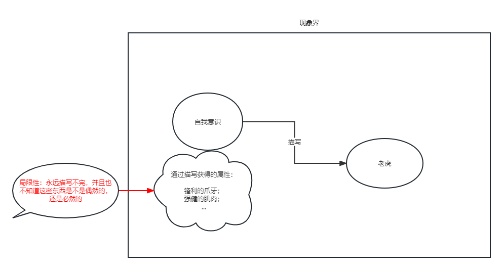

二、属性

因此，意识需要放弃这种【地毯式】的描写，而是从描写中提取一些【属性】出来。理性认为，自己描写的东西（物的属性）本来就应该是物的本质的东西，而其他自己觉得不重要的，或者没有描写的东西，就是非本质的。

同时，理性相信事物的本质就是自己，自己是一切的实在性。因此理性认为，自己在认识活动中抓住的事物的赖以区分的特征，并不是偶然，而是事物的本质性方面。例如动物的爪牙和牙齿，【不仅仅是我们区分动植物的标准，而也是动物为了保护它自己、捕猎的武器，是动物本身的本质】。

然而，这些东西可能并不是固定的。因为【事物并不是总有固定的属性】，是流变的。例如没有爪子的老虎，那还是不是老虎呢？我们说“苹果是红的或者青的”，那么苹果腐烂成棕色了，还是不是苹果呢？
​
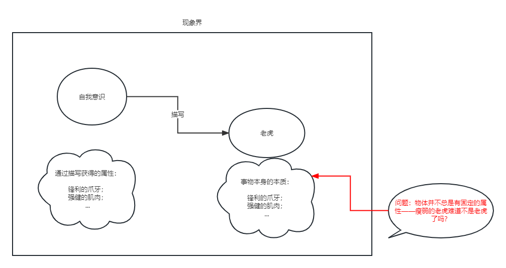

因此，理性发现，凡【不能在关系中保持其自身】的事物，凡【一事物而在化学的方式下变为另一不同事物】的事物，就使认识陷于混乱，发生争斗，不知究竟自己应该坚持于哪一方面。

因此，理性发现，如果以【属性】来规定物，那么到处是互相过渡，到处是零乱混淆。一切规定好的属性，随着观察理性的扩张，都会渐渐失去。

三、规律

因此，理性发现，这种【静止的规定性】，是不能描述世界的。对象的本性，应该是一种返回自身的【运动】。

现在理性本能既然着手探索【在对象的运动中，不失其本性的规定性】，这其实就是【规律】。例如小车、弹簧、木板构成的动态运动系统中，不变的、处于支配地位的，就是牛顿动力学规律。

然而，由于是【观察的理性】，理性只是观察了一些现象，然后就得到了一种普遍性的结论。因此，【规律就必然有偶然性、或然性因素】。例如规律并没有把所有的石头都捡起来，然后撒手，得到“石头都会落地”这个规律。因此，这种类比的方法，说到底，也只是“或然性”，并不是“必然性”。

在这里，理性为了说明规律在物那侧是必然成立的，就需要假定一个【纯粹概念】，来说明【物必然的拥有那个纯粹的概念，因此所有的物都是满足这个规律的】，来【抵抗或然性】。例如：理性在这里解释说：所有的石头会落地，并不是我的一个归纳，而是石头内部是有一个【重】的【纯粹概念】，它【必然】要和大地产生坠落、吸引的关系（当然，这些只是理性的假设）。

因此，理性在这里就必须把现象【纯化】为纯粹的概念，这种过程叫做【实验】。【实验】会将【规律的环节】与【特定的存在】之间的一切【关联】完全予以【消除】，得到【纯粹概念】。比如，在经过了对很多个物的实验之后，我们发现不仅仅有【石头的重】，还有【手表的重】、【铅笔的重】、【水滴的重】，最后总结出来【重】这个纯粹的概念，其实是在【所有的物】之中运行的、不变的本质。最终，理性得到的东西，其实是类似于【电荷】、【酸性】、【能量】这种【不依赖任何感性物体的普遍存在】，我们叫做【物质】，而不是【物体】。

然而，这有悖于观察理性的初衷——观察理性只想要能观察到的东西，现在得到了【一堆纯粹意识的构造物，一些非感性的存在，一些不能观察到的东西】。说到底，这些所谓的【纯粹概念】，其实也只是【现实的另一种描述】——不存在什么实在的【引力】，只是两个有质量的物体，必然会发生的一种【相互关系】而已。

因此，对于上述【无机物】的观察是找不到满意的规律的。本质是因为，无机物之间的关系是相互外在的。理性如果要想在无机物身上设置一种统一性，就必然是自己意识的外在构造物，是一个抽象的、非感性的、观察不到的东西。
​
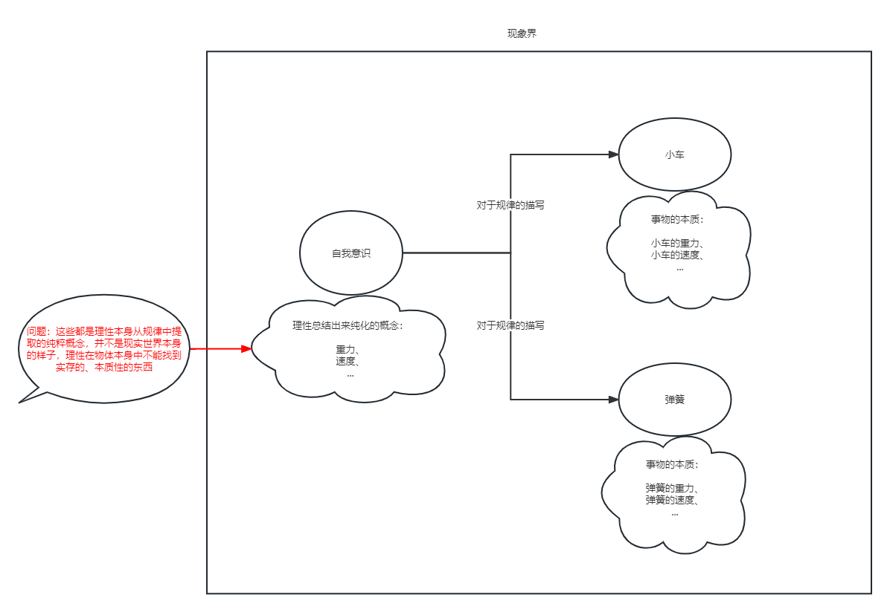

理性现在想要一种【实存】，这种实存【本身就能在运动中维持一种不变的、感性的、可观察的规律】。那么，这种物质就是【有机物】。有机物不用意识来规定什么【引力】、【电荷】，来说明一个【不变的本质】，相反，【有机物本身就能体现出来这种不变的本质】，有机物和无机自然交互的过程中，还能维持自身。例如：“老虎喝水、吃羚羊、和大自然交互，但是还能一直维持自己还是一个老虎”。
​
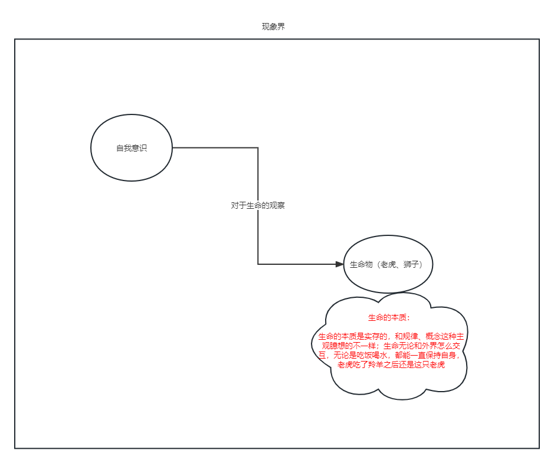

#### 有机的观察

一、内外之分

最开始，理性考察有机物的时候，按照上述的思路，其实最先考察的是有机物和无机物的对立统一关系。即，理性最开始认为【有机物的本质规律，在于和无机自然的关系】。

例如“生在【北极】的【动物】都有【厚厚的毛皮】”（由与黑格尔同时代的生物学家 G. R. Treviranus 提出的原则）。最开始的规律就是这种程度上的关联。

然而，这还称不上是规律：
1. 有机物是自由的。有机物能够躲开这些规定，造成例外。
2. 这是一种肤浅的关联。这种规律仅仅表示自然原素对有机物具有巨大影响而已。
3. 没有逻辑上的必然性。阴电必然的和阳电是对立的，但是北极和羽毛是没有任何关系的。北极和羽毛各自保留了自由，其实没有必然性。
​
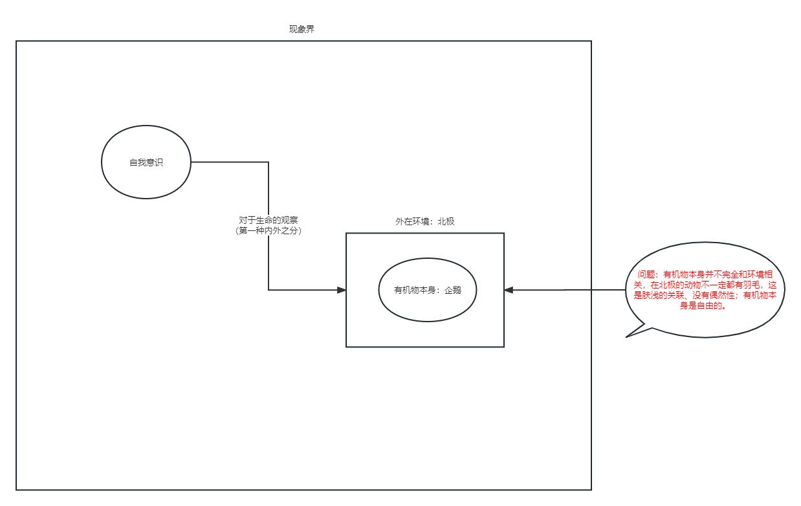

因此，有机物的本质、规律，并不在这种有机物和无机物的关系里面，而是有一种决定性的规律。即：生在北极的动物都有厚厚的毛皮，并不是由于这种关系决定的，而是有一种必然性的外在规律，有机物因为这个规律，必须在北极生出厚厚的毛皮。并且，这种必然性，如上所述，并不是由有机物和无机自然的关系决定的，那么就只能是有机物自己本身决定的。这种规律一般称之为有机物的【目的性】。这样，在有机物身上就区分出来了【内在】和【外在】。【内在】的就是有机物的【必然性本质】，而【外在】的，就是有机物的【现实表现、外观】。

在这里，有两点必要的解释：

1. 理性在这里是不认可有机物的生命的纯粹本质——无限性的，因为无限性在理性看来也是纯粹概念，而理性只想在世界中发现现实性的规律，拒斥意识建构的概念性，所以建构了【可观察的内在】和【可观察的外在】这两方面。
2. 有机物的规律和无机物的规律，区别在于：无机物的规律是【在两个独立的物构造纯粹概念，是理性的臆想】，而有机物的规律是【在同一个物身上，区分内在外在，共同构成了一个现实性的统一体，是现实存在的统一】。
​
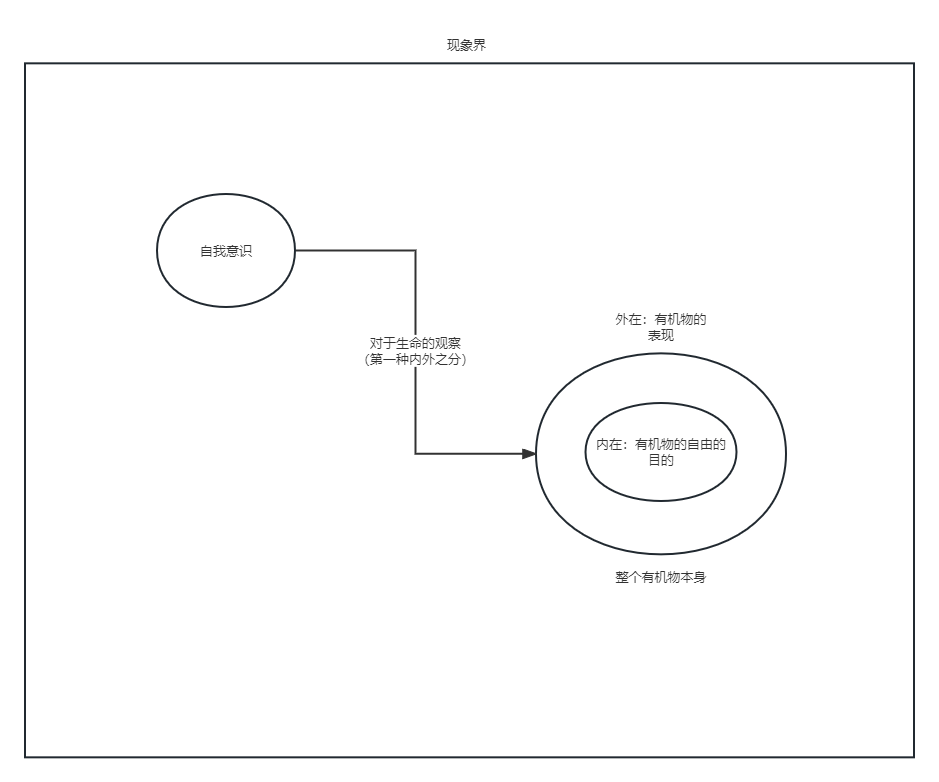

二、有机物的内在

理性可以很容易的认识到有机物的外在，比如爪牙、肌肉等等。但是有机物的内在现在还观察不到。而观察理性想要找到实在的规律，内在是必须可观察的。于是，观察理性把有机物的内在分成 3 种（这是当时黑格尔时代，生物学家的一种假说，黑格尔拿这个假说举例，其他类似的，甚至现代的生物学也可以参考）：

1. 【流动的有机本性】。例如：感受性、机动性、再生性。
2. 【内部形态系统】。例如：神经系统、肌肉系统、内脏系统、生殖系统。
3. 【纯粹的单一本质】。

注意，它们并没有一对一的关系。感受性是流转于每一个内部形态系统中的。

首先，理性考虑流动的有机本性。感受性、机动性、再生性，其实是互相规定的、互相依赖的。如果一个有机物只感受，不机动，那感受和不感受就没了区别。并且，一个有机物必须要先感受，然后再机动，不可能突然就机动。在这个意义上，我们说，一个行动，有多少感受性，就有多少机动性。因此，我们说一个有机物有感受性和机动性，其实都是【意识空洞的规定性】。进一步，如果我们承认两者是互相规定的，还要强行说他们有一定程度的数量关系，例如，如果我们强行说“感受性和机动性的大小彼此成反比，因此当一个增加时，另一个减少”（C. F. Kielmeyer 在 1790 年代制定的一项定律）。这样的规律并没有揭示任何关于生物体的任何具体信息，因为本来感受性和机动性都是无所谓多少的，理性本身想说多少就是多少，这就是【空洞游戏】的产物。因此，它实际上并不是有机体固有的规律。进一步，如果我们把这两个规律设置成毫无关系的对立，我们可以说“有机物 A 的机动性比 B 高”。那么就和“颜色”、“形状”等属性没有区别了，完全僵死了。和前面的“老虎的本质是自己的爪子”这种把【无机的观察】中的不变的【属性】当做有机物的本质没有区别。它们在逻辑上是不能保证有机物的统一性的，不能成为有机物的本质。
​
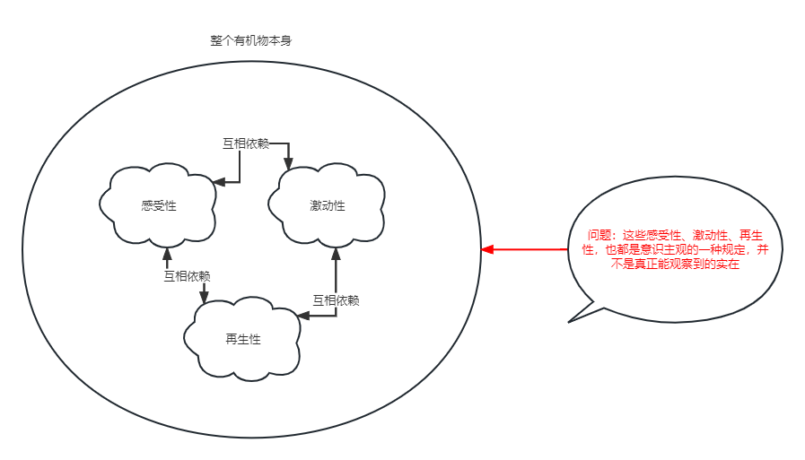

其次，理性需要考察有机物的形态系统。根据形态系统来理解有机物，乃是就其抽象的僵死的存在来理解的；在这样理解之下，有机物的环节是解剖学与僵死的尸体上的东西。在这样的形态系统里，有机环节毋宁已经停止存在了，因为它们已不再是历程。因此，理性看到，有机的本质，要求有机环节是流行运动的过程。如果把有机物强行划分成各种“流动性”、各种“系统”，都不可能在有机物身上找到任何规律。
​

最后，我们只能把整个有机物的内在本质看成单一的、返回自身的存在。因此，这个有机物的本质，就不再有任何本质的规定性。不再有什么“感受性”，不再有什么“形态系统”，就是单纯的、内在的一。那么，对于这种有机物的内在本质，理性没有办法内在的考察，只能从【量】上面考察，把这个有机物的各种内在属性，还原成【一个机器学习的 embedding，一个特征矩阵】，例如：繁殖力、感受力、机动力，等等。这也不是规律了。因为【量】也是一种僵死的、漠不相干的、非本质的规定性。它们在逻辑上是不能保证有机物的统一性的，不能成为有机物的本质。理性不能说，因为一个老虎有强大的感受力，所以它是老虎；蠕虫有微弱的感受力，所以它是蠕虫，这样的量上的区分是没有道理的。
​
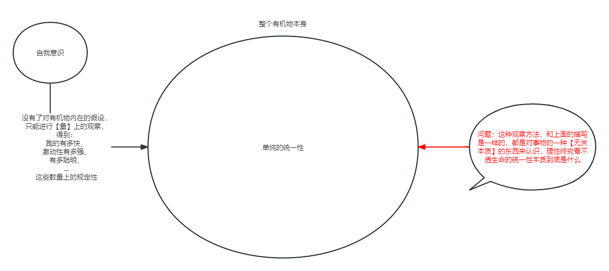

三、整个有机物

因此，把有机物分成内外两个存在，是得不到规律的。现在还剩下的是把有机物当成一整个本身，然后去考察这个有机物的纯粹内在和外在的关系。因为有机物的内在是【自由】的，是【没有本质规定性】的，因此有机物在自然界中的展现，即整个有机物的内在方面，还是按照【量】来量化规定的。理性在这里的规律，是“因为老虎有很多个、很强大的牙齿（数），因此它们可以捕猎羚羊”。还是把这个有机物的各种外观属性，还原成【一个机器学习的 embedding，一个特征矩阵】。这也不是规律了。理由同“有机物的内在的第三点”。

#### 整体的观察

此时，理性发现自己去考察“单个无机物”、“单个有机物”这样的规律，已经都失败了。因此，理性新的格局是：把【整个无机自然】、【整个有机系统】作为对象，考察它们的外在和内在。

3.1 无机自然

理性首先考察“整个无机自然”。对于所有无机物，就要找到一个“内在”。

首先，理性外在的设立了一个整个无机自然的【内在】本质属性：【比重】（也许是来源于牛顿的动力学定律）。其他的特质，例如【形状】、【颜色】、【硬度】、【韧性】以及无数的其他特质将会共同构成规律的【外在】方面。【比重】可以让一个物成为【独特的这一个】。然而，一个物要想成为自为存在，就要和其他的物区分开，就要具有【排他性】。然而比重并没有这样的功能，它只是一个【单纯的规定性】。因此，比重和其他的所谓形状、颜色一样，只是一个【非本质的属性】。

因此，物还需要【凝聚性】（也许是来源于牛顿的万有引力定律），使得这个物成为【与其他物分开的这一个】。

那么，为了把这个物和其他物分开，凝聚性有两种方法：

1. 【凝聚性】表示为一种类似有机物的【自我保存】，它就依靠这【自我保存】而不至于成为这个过程的一个产物，成为这个有机物的【灵魂】。然而，无机物是不会行动的，更不可能有保持自身的表现。无机物没法像有机物那样，进食、逃跑、喝水，理性观察不到无机物的统一性的实质性现象。因此，理性认为这种设定只是一种【空洞的意识活动】，并不是事情本身的样子。
2. 【凝聚性】表示为一种【属性组合】，它把所有属性捆绑在一起，和其他物产生差异。这样，物就又变成【一个机器学习的 embedding，一个特征矩阵】。仅仅是数字的排比，不能代表任何本质的规律性。这只是【仅仅把本质呈现出来】。这不是规律的做法，规律要找到内在的联系。
​
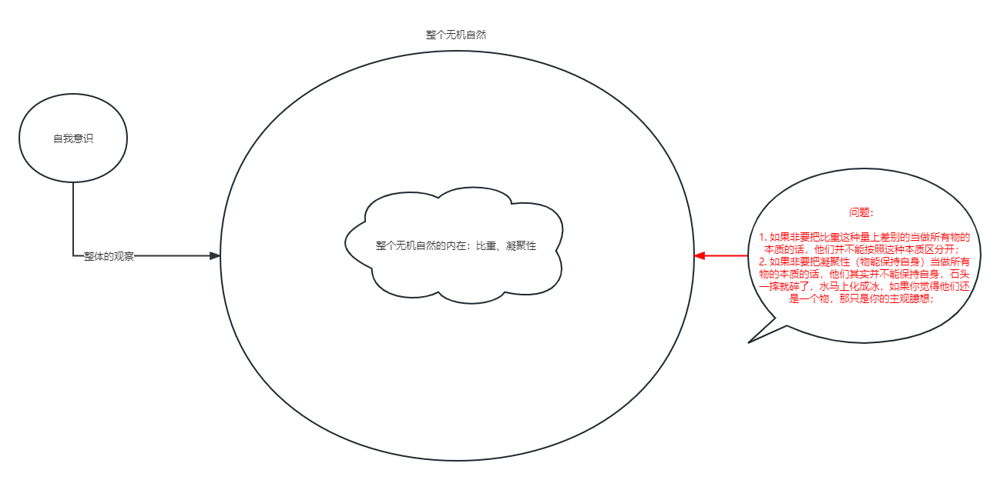

3.2 有机系统

理性在【无机自然】身上找不到本质的内外特征，然而在【有机系统】这里是可以的。有机系统天然就是统一的、普遍的，或者说，它因此就是【类】。每一个有机物一定要保持自身，一定要繁衍自身，共同维持一个【抽象的类】的【概念延续】。

另一方面，每一个有机物都有自己的【个别性】，即有机物当前的现实性。有机物的个别性是纯粹的否定性可以够扬弃自己的数量、规定性，保持自身的统一性。【量】对于有机系统，只是非本质的。

因此，这里就遇到一个问题。有机物的现实，不可能是由抽象的类发展来的。因此，在【抽象的类】和【现实的个别性】之间，还有一个中介，即【种】。【种】是对每一个有机物的现实规定性。

然而【种】这种规定性，在理性看来，还是体现为【量】——例如：考虑“日耳曼人种”，和“全体人类”的区别，还是那个量上的规定性。然而，因为【个别性】是纯粹的否定，有机物认为自己的【个别性】才是本质，而【量】只是自己的外延，是无关本质的。
​
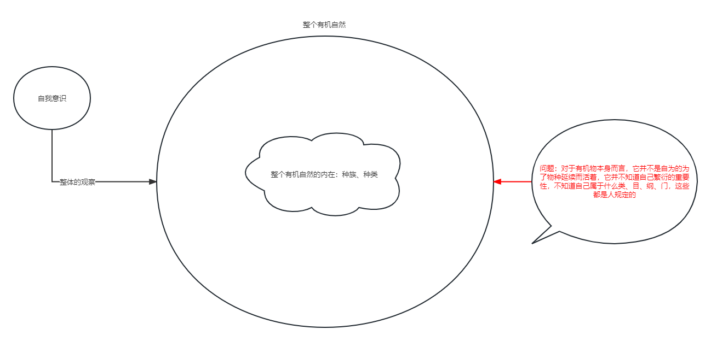

3.3 偶然的理性

因此，理性发现，有机物的普遍性，其实是直接跌落在现实性中的，这其中并没有什么【本质性】的中介。有机物的【个体性】、【现实的形态】，也只是整个有机系统的一种【偶然的赋予】。

那么，理性人为的，按照自己意识来构建的按照类、种的分类的有机物体系，将会被【整个有机系统】、【普遍的个体】、【地球】（这三个词在这里是同一个意思）打破。地球虽然分化了很多个独立的个体，但是站在个体的角度，每一个个体的形成都是偶然的，没有什么必然性的因素。个体只是保存着自己的统一性，并不知道自己属于一个普遍的有机系统，属于一个地球。因此，在理性对个体进行分类、分种的操作时，会面对【地球的强力】。因为从地球分化出来的个体本身就是偶然的，所以会超越、打破这些人为的规定。

因此，观察理性在自然界中，所能达到的，也不过是找出【一些机智的意见，有趣的关联，和发现有某种对概念友好的迎合情况】而已。这些都不是必然性的知识。

### 对自我意识的观察

现在，观察理性发现在世界中是发现不了必然性的：

1. 在无机自然里面，自我意识发现了现实性的概念，例如比重和其他特质。但是这些概念【没有返回到自身】，只是外部数量的规定性，并不是【本质】，没有必然性。
2. 在有机系统里面，自我意识发现了抽象的、并且返回自身的概念，例如类。但是有机物的【个别性】和【类】是直接统一在一起的，没有一个【现实的中介】，也就没有一个【必然性的展开过程、分化过程】。理性通过【类】、【种】的建模，只是一种【有趣的关联】，没有必然性。

因此，理性在这里就要考察一个【真实存在的中介】、【现实性的、返回到自身的概念】。这样一种中介，能够作为普遍的概念，必然的分裂出个别性，然后可以从这些个别性返回自身那个普遍的概念。即，原来在有机系统考察的时候，发现【生命本身是只是自在的，而不是自为的为了自身的统一性而活着的】，然而【自我意识】是。

【自我意识】是完美符合理性的要求的——【自我意识】分裂成【意识】和【对象】，然后意识发现了【对象的确定性是意识的建构】，于是回归成了【自我意识】。这其实也是一种【无限性】的结构。

因此，观察理性，现在就要检查自我意识里面有什么规律。

#### 纯粹的逻辑规律

然而，【逻辑规律】只是纯粹的思维，是纯粹的【形式】（这里形式的意思是，思维中的东西没有实在性，只是纯粹的思维认知工具，例如“A=A”这种概念定律，还没有应用，就是纯粹的一个符号）。因此【纯粹形式的逻辑规律】没有【真理性】，是【空虚的抽象】。没有说出任何东西。

然而，逻辑规律虽然是形式的，但是我们可以把【一切内容】、【概念】套用在这些形式逻辑上面，让这样的规律拥有【内容】。例如矛盾律，可以应用到任何概念上面。这样可以得到【有内容的逻辑规律】。

但是，【有内容的逻辑规律】，作为观察理性的内容，是没有【形式】的（这里形式的意思是，没有更深层次的共同点、统一性。比如说，我们知道“苹果是红的”，这句话就是纯粹一个内容，没有形式，因为我们通过这句话还不知道苹果为什么是红的）。因此，这些【有内容的逻辑规律】，其实只是一个【统一的运动中的一个环节】。

比如我们说“苹果是红的”，这只是思维中的一环，概念还要继续发展，我们还要继续追问苹果为什么是红的，红是什么，苹果是什么，我为什么能看见苹果，等等。

再比如，同一律的例子“这个兔子是这个兔子”，这就是一个【僵死的、瞬时的判断】。兔子是在运动的，必须将同一律投入事物的差异和变化之中，到运动和矛盾发展中去求同一。你才能说“在什么情况下，在什么角度上，在一个时间序列的变化中，这个兔子还是这个兔子”。这样，【有内容的逻辑规律】才会有真正的【形式】。

因此，【纯粹形式的逻辑规律】和【有内容的逻辑规律】都没有真理性。理性和之前一样，也是把统一的运动分开、固定下来观察，当然是发现不了真理的。
​

#### 逻辑规律的实现——心理学规律

因此，理性发现，在【纯粹】的【逻辑规律】里面，连【形式上的真理】都发现不了。因此，观察理性决定观察【现实】的【逻辑规律】，这种规律表现在现实中，即【行动的意识】。那么这就是【心理学】。

心理学也包含一批规律，主要可以分成【意识对现实的两种态度】：

1. 接受现实。意识【适应】现有的“风俗习惯”、“伦理道德”以及“以精神自身为对象的那些思维方式”，等等。这种态度【否定了自己的个别性】。
2. 反对现实。意识进行独立思考，根据自己的“兴趣情感”来【挑选】其中“特别为它自己的东西”，使客观事物适应于它自己。这种态度【否定了自己的普遍性】。

这只是最肤浅的观察。理性进一步观察到：行动意识有各式各样的能力、兴趣和情感，简直是一个集合体。因此，理性就把这些一一记录下来：某人的理解力比别人强，另外某人的情感比别人丰富等等。然而这只是最外在的归类，把有意识的个体也这样【无思想地当作个别的存在着的现象来观察】，是【无关紧要、非本质】的。
​

因此，理性就要把这些【个体性归类成普遍的形式】，来找出【个体性的规律】。

#### 个体性的规律

因此，现在摆在眼前的规律的两端是：

1. 个体的行动意识。
2. 个体周围的自然界，例如环境、家庭、风俗、伦理、宗教。

理性就要把 1 往 2 上归类。

接下来就要考虑自然界对个体到底会有什么影响。理性大致观察到了 3 种影响：

1. 个体适应自然界。
2. 个体反对、改造自然界。
3. 个体漠不关心自然界。

然而，个体采取那种态度，其实是【完全取决于个体自己】。因而当我们说这个个体是由于这个或那个原因才成为它这个特定的样子的时候，只不过是说它本来已经就是这个样子罢了。

环境、家庭、风俗、伦理、宗教，事实上所显示的只是个体性的那种【无关紧要、非本质的规定性】。

因此，对于【个体眼前的自然界】、【个体性的世界】，包括个体周边的环境、家庭、风俗、伦理、宗教，等等，其实都是【不稳定】的。并没有一个稳定的意义世界，从中产生出个体。个体和个体身边的意义世界，是【相互影响、相互建构】的。个体既可以听任现实的影响之流对自己冲击，也可以截住它，颠倒它或改变它。

因此，心理学的必然性，就变成了一句空话：个体也许受到了某个环境的影响，但是不一定。
​

### 对自我意识和现实关系的观察

理性在心理学这种外在的行动上面发现不了个体性的规律，于是转而自身，考察【个体本身的现实性】，即它天生的躯体。

个体有一个天然的对立：

1. 是意识的运动
2. 是固定的现实存在

以前所谈的是普遍的或一般的伦理习俗和文化教育，现在所涉及的则是人类的一般的形象，或至少也是指一种气候里、一个大陆上、一个民族里的人的一般形象。

这也是一种内-外的模式。理性现在就要在这之间找到规律——寻找内在的统一性，和外在的现实有什么关系，是怎么表现出来的。

#### 面相学

一、行动

首先，理性认为个体的内在，是【活动】本身（语言、劳动），而活动本身，通过器官（手、口、腿），作为一种【从个体中分离出来的现实】表现出来。

然而，这种对于内在的表现的问题是：

1. 太多了，直接把自己的内在交出去了。
2. 太少了，变成了一个另外的、固定的东西，这个行动的结果，其实和自身内在是分离的、毫不相关的东西。

这个表现出来的外在，可能会被颠倒改变，出于以下两个原因：

1. 由于其他个体的【变化因素】影响，行动【被颠倒改变】的另一个东西。
2. 由于自己个体的【隐瞒】、【失误】，行动【本身就是颠倒改变】的另外一个东西。

因此，行为本身说来，既可以表示内在，也可以表示不是内在。行动的结果，对于内在的表现而言，其实是【模棱两可】的。
​

二、持存的事物

因此，能够表现内在个体性的，就不应该是个人行动，而是一个【持存的事物】，一个【内在的符号】。

然而，这种符号本身是被理性【任意】、【武断】联合起来的，其实本身并不具有什么意义，当然也就不构成规律。比如星象学、手相学。然而面相学据说是有一种必然性。

然而，其实手相学，也不完全是外在的，有其内在的因素。因为手是除了语言器官以外，人们使用最多的器官，它本身是创造自己幸福的创造者。因此，手也是人行动的结果。

因此，我们这里对器官，和之前有不同的看法：

1. 之前的手，只是实现作品的工具，是纯粹外在的。
2. 现在的手，既是工具，也是自我实现的一种结果，手本身有一定的内在性。

因此，除了手以外，包括笔迹、语调、面相，其实都有一种内在性。他们是这个人固定不变的，并且是实现自己作品的一个【中项】。他们本身是外在，但是没有完全外。通过他们实现出来的语言、作品，才是真正的纯粹外在。

因此，广义的面相学，其实就是说，可以在【外表上不失其内在的东西】身上，观察到一个人的内在。

和之前不同的是，之前认为【语言可以表达内在】，而现在则认为【说话的方式可以表达内在】。

然而，上面说，【语言】可以被【误解】和【伪装】，那么其实【说话的方式】也可以被【误解】和【伪装】。作为【语言】和【说话的方式】作为一个人的【存在着的表示】，其实没有本质区别。比如我可以误解你，说“你这句话是不是反语啊”，也可以同样误解你“你现在是不是在阴阳怪气啊”。

因此，个体的形象是不可能表示内在的。
​
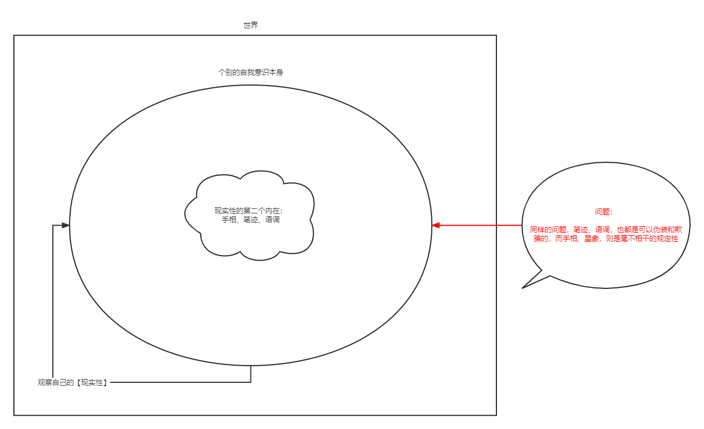

三、面相学的思想基础

因此，面相学的本质，其实就是：

1. 认为【内在的外在表现】，是【形象】，而不是【作品】。
2. 认为【内在】，是【意图】，而不是【行动】。

因此，无论是一眼判断一个人好坏的【识人科学】，还是企图把这种判断加以丰富描述的【面相科学】，其实都是【既无目的又无基础的东西】。只是一种【感性的意谓】、是一种【个人意见】。

真正说来，人的真正存在，应该是人的行为，而不是躯体：

1. 在【内在的表现】方面，行为扬弃了躯体的【定在】，实现了人的无限可能。
2. 在【内在】方面，行为扬弃了意谓的【不可形容性】，是可以被规定、被把握的。杀人放火、见义勇为，都是人人承认的事情。

然而，这个人可能会觉得自己的行为会被误解，并且自己会有失误。然而，自己必须要表现出来，只有表现出来才能被看到，否则什么都不是。不能把人的【行为】抛开不谈，转而谈论【感性意谓中的意图】和【静止的形象】。

#### 头盖骨相学

至此，在能表现内在的躯体部件中，其实还有一个没有讨论的——直接的、坚固的、纯然具体存在着的现实。在面相学中，我们讨论的都是【精神通过事物间接表现出来】，而现在要讨论的是【精神通过事物直接表现出来】。

一、 寻找精神所在地

首先，我们要考察精神本身。那么【精神能对肉体发生影响，精神就一定是肉体的】。

因此，接下来就要找到，精神到底在哪：

1. 精神不是口、手、腿这些【行动器官】，因为这些是【工具】，是【精神的桥梁】。
2. 精神不是肾、肺这些【内脏器官】，因为这些是【构成躯体的运动着的一部分】，是【动物性的现实】。

然而，【神经系统】确实一个【静止的持存】，它不需要参与一个躯体的哪一方面功能，而是纯粹控制者躯体，是意识的执行通路。并且它是流动着的，支配着身体的各个部分。

因此，我们有理由相信，【神经系统】就是精神流动的场所。并且【神经系统】的源头，就是【大脑】和【脊髓】。一般都认为是【大脑】，那这里就仅仅谈论大脑。如果谈论【脊髓】对神经的影响的话，可以谈的就太多了，【肺的调息】也影响神经，就说不完了。

因此，我们把【大脑】当成【精神的所在地】，同时把大脑所在的【头颅】当成一种【精神作用的直接对象】。

因此，我们就可以通过观察头颅，来观察大脑，也就是精神所在地的特性。

二、头颅和大脑的关系

首先，我们认为，大脑和头颅有一种【双向规定】的关系：

1. 大脑是真正的精神器官，它某处活跃，就会挤的头颅某处凸起，塑造了头颅的外形。
2. 头颅也是有机物的一部分，它对大脑施加压力，塑造了精神器官的外形。

然而，由于【自为存在的个体性】，其实落在大脑和头颅两端，因此他们其实【没有互相规定的关系】，而是有一种【预先的和谐】——他们的每一方面，其实都是个体性提前设立好的。因此，其实是说：

1. 头颅对大脑、大脑对头盖骨，都没有直接力的作用，同时形状和性质也没有规定作用（并不是说哪块凸起了，哪块功能就越强）。
2. 头颅和大脑之间的关系，其实是回归到个体性给他们的规定性上的。

因此，从形状和大小这种外在的观察方法，来考察头盖骨，是偶然的，没有规律可言的：

1. 头盖骨对大脑没有机械的、力的影响，并且大脑的形状（精神的存在）和性质（精神本身）上也没有关系。
2. 即使我们承认 1，我们也说不出来，这种影响到底具体是怎么样的，头脑是大还是小、头盖骨是突出还是凹陷、突出的方式是什么样的，才能代表精神更发达。

按理说来，因为是【预定的和谐】，因此不能观察【头颅】和【大脑】的关系。

因此，我们直接观察头盖骨和这两者的共同本源——那个个体性的关系。从这个角度来看，我们可以假定：头盖骨的表现，就能代表那个纯粹统一、个体性的精神。

三、考察头盖骨

因此，我们来认真的考察头盖骨：

1. 头盖骨没有符号价值。人的任何行动和头盖骨无关。头盖骨和表情、手势、腔调不一样，我们不能从头盖骨中看出和这个人的任何直接关联和特性，都是毫不相关的。头盖骨是纯粹直接的存在。
2. 头盖骨没有感觉。即使有人觉得自己努力思考的时候头疼，或者杀人、赋诗的时候会有特别的感觉，那也只是一般的感觉，也许只是一般的头痛。我们并不能分辨出来具体的感觉到底怎么对应的，太过于笼统。

因此，头盖骨的任何可考察的联系都没有了。剩下的只是一些纯粹的规定性，例如【某片头骨对应某种品性】。然而这也是【十分武断】、【莫须有】的。

例如我们想发现海盗的品性对应的头盖骨特征：

1. 我们没法做对比实验，海盗身上有太多精神属性了，例如勇敢、贪吃、有暴力倾向，等等，没法【一一对应】。
2. 我们也不能假定一个精神属性是一一对应的。有可能一个属性对应多个骨头，一个骨头对应多个属性，没法【多多对应】。
3. 我们甚至不能假定一个人的精神属性仅仅存在于它的头盖骨上面，为什么不能是强盗的性格体现在它邻居的头盖骨凸起，没法【在多个人身上对应】。
因此，头盖骨就是纯粹的头盖骨，在他身上的各种发散想象就到此为止。

四、潜在

给头盖骨相学辩解的人，还可能有这样的论据：

1. 人是自由的，人的原始存在只是一种【潜在】、【天赋】。这种【潜在】、【天赋】只是在有利的环境下才能实现出来，但是不一定会实现出来。
2. 当头盖骨相学做的预测和人的现实矛盾的时候，它可以说，这个个体【本来应该】是按照头盖骨相学所说的那样发展的，只是没有环境，没发展出来。

因此，这种说法就等价于：头盖骨相学【既】可以指示一种已经存在的【现实】，【又】可以指示一种没存在的【潜在】。实际上也就等价于：头盖骨相学【既】可以【说了什么】，也可以【什么都没说】。

更荒谬的是，本来人的现实是一种潜在，头盖骨相学却只是看最僵死的头骨，就认为或者推测这个头骨可以代表人的潜在。
​
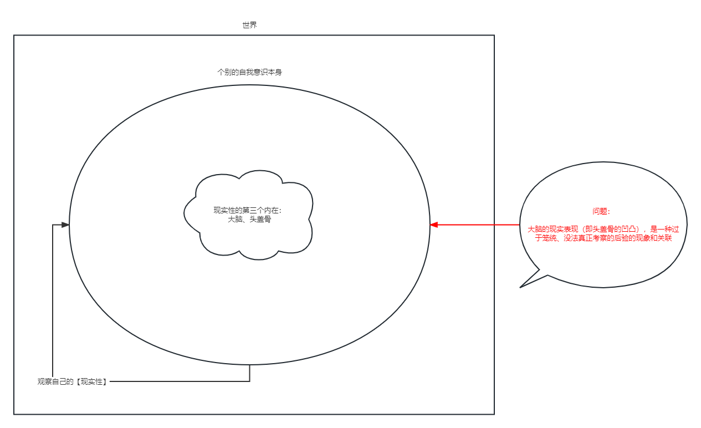

### 总结

以下简述观察理性的流程。

最开始：
1. 在无机物中，只存在一些【纯粹的抽象】和【单纯的概念】。在无机物的演化过程中，【内在】是一个并不实存的内核。
2. 在有机物中，【内在】就是【否定的本质】、【绝对的个别化】，与普遍对立，让有机物可以一直实存。但是找不到概念，因为有机过程只是【自在】的自由，并不是【自为】的。有机物的【自为】性，体现于它的【目的】。

因此，理性此时需要的对象，是【作为目的本身而实存的对象】，这样的对象就是自我意识。因此理性就观察自身：

1. 思维规律，并不是持存的东西，只是以环节为内容。

因此，意识就把这些思维规律汇聚起来，合成到了单一的个体，继续观察：

1. 个体与外在环境的关系，包括心理学、个体性规律。
2. 个体与自己行动和作品的关系。
3. 个体与自身外表形象的关系，即面相学。

最终，意识从这些变化的、漠不相关的符号，回到了不变的定在上来。认为：精神是某个事物；或者说，精神是像一块骨骼那样僵死存在的事物；或者说，精神是一块骨骼。

在这里，意识把精神的现实自身说成了一种事物，或者颠倒过来说，给僵死的存在赋予了精神的意义。

从这个【精神是事物】这个【无限判断】中，理性就必须向实践出发。

## 三、实践的理性

现在，自我意识发现：

1. 【自我意识是事物】，自我意识认识到，自己就是客观现实，是一个个别性，自我意识不能仅仅把自己放在观察的屏障之后，因此自我意识才会观察自己。
2. 【事物是自我意识】，自我意识观察而来的那些感性事物，形式上都应该是被扬弃的。无论是无机物、有机物、【这一个自我意识】的思维规律、心理学规律，【这一个自我意识】的个体性、面向、头盖骨，等等，都是表面的，不能让自我意识找到自身的确定性。能让自我意识找到自身确定性的，只剩下了【另一个真正的自我意识，而不是另一个自我意识所表现出来的现象，例如语调、笔迹、头盖骨等等】。

并且，这个独立的、另一个自我意识，也不是什么外来的东西，我们两个天然就是【相互承认】的，形成了一个天然的【自我意识统一体】（理性章的基本设定：世界上任何其他存在，都是和我合一的）。因此，这种相互承认，本身就是一种【精神】。

因此，我们现在要考察【这一个自我意识】和【自我意识统一体】之间的关系。自我意识要【走进统一体】、【成为统一体的对象】。
​
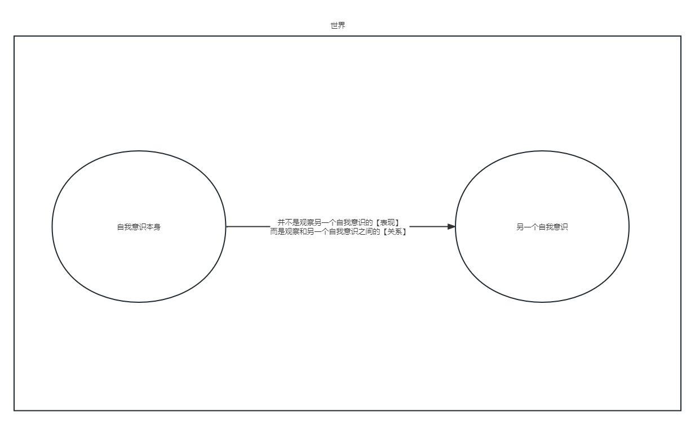

### 伦理实体

实践理性的历程是：

1. 意识到它自己仅是一个个体，作为一个个体它必须在别的个体中要求并产生出它的现实来。
2. 个体变成了普遍的理性，并意识到它自己就是理性，意识到它自己就是一种已经自在自为地被承认了的东西，而这被承认了的东西在它的纯粹意识里统一着一切自我意识。

【伦理】就是这个内在的精神的具体存在。所谓的伦理，就是【众多独立的、现实的个体，在本质上形成的一个精神性的统一体】。伦理的实现依赖于每一个意识，而每一个意识因为伦理获得了完满的独立性。伦理既是抽象，是处于思想中的规律；也是现实的意识，即礼俗伦常。

伦理的事物性，就像光分散为无数个光点那样。光点自在自为的消融在光里面。个体知道，他们之所以是这些个别的独立存在，是因为献出自己的个别性，把这个普遍的实体当做它们的灵魂和本质，它们才有可能作为一些个别的独立本质存在着；而这个普遍的实体，也只是它们共同创造出来的事业。

个体不仅仅在伦理中获得了形式，还有内容。个体处于生理需要进行劳动，而他的劳动，在伦理实体中不仅仅满足了他自己，也满足了其他人，其他人的劳动也满足了他。个人在他个别的劳动中，已经无意识的从事着一种普遍的劳动。他为了集体牺牲了自己，因此从集体中赢得了自己。

因此，在伦理实体中，每个个体都是互相依赖的：我在所有人那里直观到，他们和我一样，就其自身而言是一些独立的本质，我和所有人组成了一个自由的统一体，这个统一体依赖于我，也依赖于他人——他人就是我，我就是他人。
​
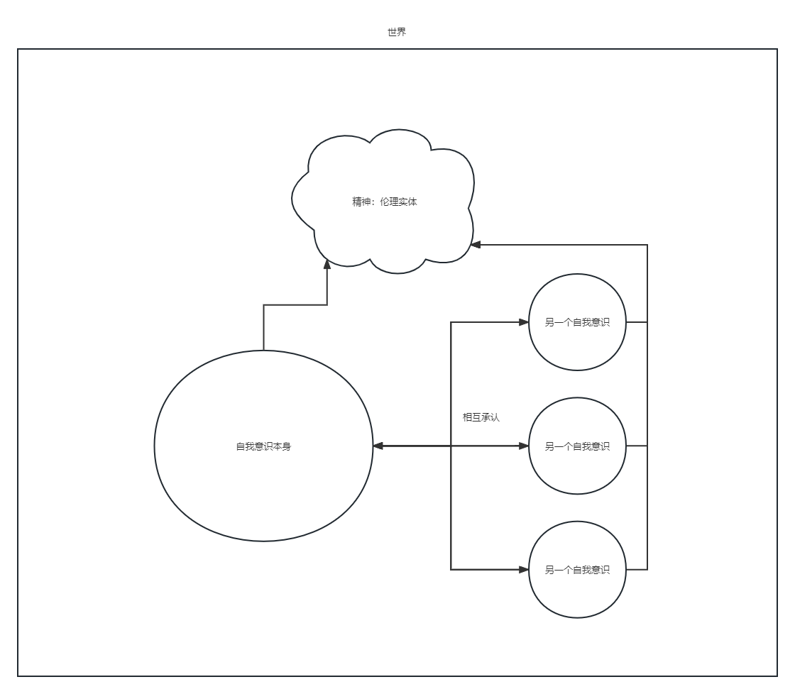

### 道德实体

然而，精神已经从伦理实体中走了出来。伦理实体是一种【直接的、个别的精神】。比如，斯巴达人有斯巴达人的伦常，而中国人有中国人的伦常。这些都是个别的，并不是绝对的。如果个体直接以实在的伦常亦即民族的生活为它的生存，它就是一个【具有坚实信心的个别意识】，这个个体还没有想到自己是一个【纯粹自为的个别性】。比如说，中国人可能有茶道，一个个体生在中国，耳濡目染，如果喜欢上了茶道，那也只是一种【先天的幸运】，是一种【淳朴的、非反思的统一】。
​
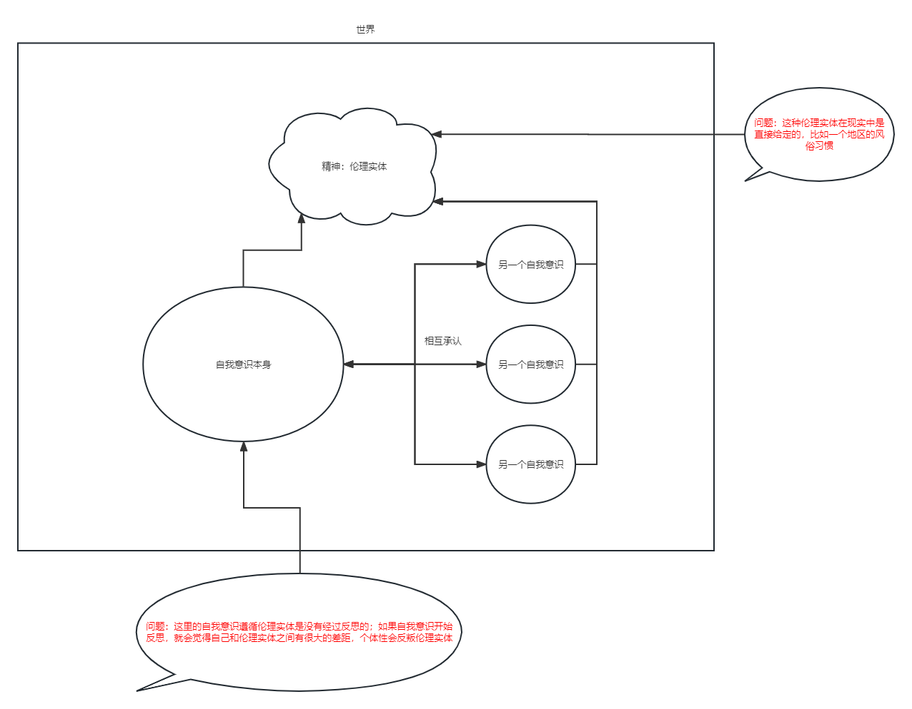

当个体认识到自己的【纯粹自为的个别性】，它的信心，就通统【丧失】了。个体是【自为而孤立】的，【它就是它自己的本质】，而【普遍的精神不再是它的本质了】。个体就进而与伦理实体对立起来，认为只是【没有绝对本质性的思想】、【没有现实性的抽象理论】。但是个体，作为这一个【特殊的我】，在它自己看来乃是【活的真理性】。因此，自我意识抛弃了【伦理】，走向了【道德】。

当然，也可以说，原来的意识其实还没有步入伦理实体，或者说，原来的伦理实体并不是真正自为的伦理实体。在这个意义上，【从伦理实体到道德迈进】这个过程，其实也可以说成【自在的自我意识向伦理实体迈进】。

因此，后文所说的【伦理】、【自为的伦理】、【道德】，其实都是一个意思。

### 快乐与必然性

理性最开始的目的，是把【另一个自我意识】当做欲望的对象，在它身上认识到自己，或者让他成为自己。像《自我意识》章里面，两个自我意识相遇那样，理性产生了想要成为【主人】的欲望。

理性已经摆脱了伦理实体和静态思维，而是成为了一个自为存在。因此，理性已经将伦常、知性、规律、科学等等，象一种灰暗的、正在消失着的阴影一样，抛到自己身后。
​
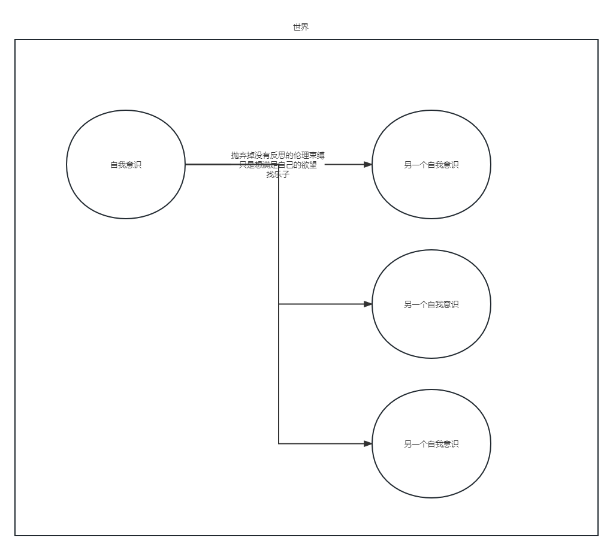

而理性现在所持有的，其实是一种【地上的精神】，或者说【世俗的精神】。理性认为只有象个别意识的现实这样的存在，才算是【真正的现实】。而所谓的伦常、知性、规律、科学等等，都是飘在【天上的知识】，和我们真实中的人无关。伦常、知性、规律、科学都是有限的，无法解答生命意义的问题，理性无法在这些【天国】中找不到确定性。因此理性向前一步，尝试从静观自然走向介入生活，在任意满足自身感性欲望的过程中实现其主体性。

现在，浮士德走出了图书馆，来到了下等酒吧。“它蔑视科学和知性，这人类至高的才能——它奔降于魔鬼的麾下而终必归于沉沦。”

理性在这个阶段，肆意的抓取任何可以掌控的对象，来满足自己的欲求。

#### 快乐

在最开始的时候，理性只是把欲望的对象当成【物性】来看待，欲望和欲望的对象，只是看起来是独立的，实际上欲望的对象，只是有一种表面的、形式上的独立。理性在欲望满足的同时，欲望的对象也就被扬弃了，这是一种【永无止境】的欲望的追求。

因此，这种物性，是不能满足欲望的。理性必须把欲望的对象当成独立性的意识，只有在这样的对象身上，欲望才能得到真正的满足。因此，欲望的满足，其实是【两个独立自我意识的统一】。

例如，原来的【物性】的、【个别】的欲望，可能只是【肉欲】、【控制欲】等等，是低级的、动物性的欲望。这种欲望满足了之后，会立刻产生新的欲望，是无穷无尽的，立刻被扬弃的。而如果理性把欲望的对象，当成独立性的意识来看待的话，他的欲望可能是【爱情】、【事业】、【攀比心】、【成就感】等等。这种欲望是【社会性】的，是在每个自我意识相互独立平等的前提下建立起来的。得到一只猫的认可是没意义的；但是得到身边的，和自己一样理性的人的认可，则是快乐的。

因此，理性现在享受了快乐，同时也直观到了两个独立自我意识的统一，达到了自己的目的。

然而，在这个【统一】中，理性原来认为自己【个别的、自为存在着的本质】，在通过【社会性】的【统一】而获得的快乐的过程中，已经被扬弃了。自我意识扬弃了自己的个别性（自身的欲望），反而拥抱了普遍性（社会性）。
​
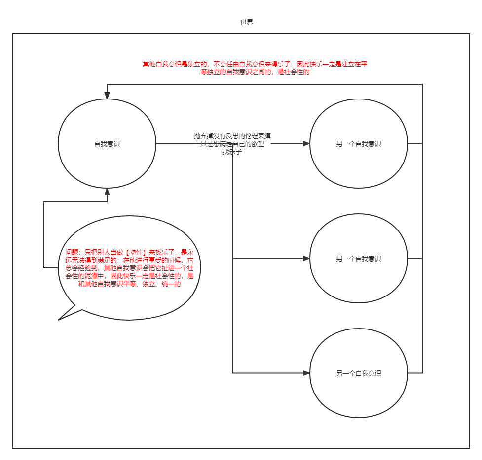

#### 必然性

这样的普遍性、社会性，其实还是最贫乏的一种精神，是个体性与社会性的直接的、未经反思的统一体，是抽象的范畴。

在自我意识认识到自己快乐的社会性之后，自我意识发现，它的快乐，其实并不像之前想象的那样，是随便拿来就有的，之前预想的那种快乐是一种【空虚的本质】、【个别性的虚无】。相反，自己的快乐是否被满足，其实并不是自己控制和决定的，而是有一种不得遏止、不可阻挠的，是一种【绝对的社会关系的抽象运动】，来决定自己是否快乐的。这种绝对的社会关系的抽象运动，在自我意识看来，是一种【必然性】、一种【命运】。

因此，理性本来想走出死的理论而投身于生命里去，然而却只是投身于一种冰冷的、空虚的、必然的、死的现实中。
​
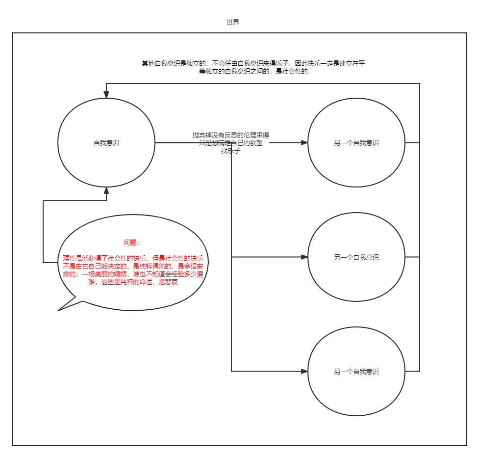

#### 自我意识的矛盾

自我意识现在就是这样一个过度：从纯粹的追求自己的快乐，到认识到这个社会关系的冰冷的必然性。这个过度，是不经过任何中介的，而是一种【飞跃】——理性只知道自身的快乐如何实现，却不知道自己经验到的那个必然性，到底是怎么来的。

因此，没有被理性所理解的、抽象的【必然性】，就把个体性给【粉碎】了。理性已经【丧身】于必然性之中。

比如说，相爱的两个人是幸运的、快乐的，但是爱情之路会遇到许许多多的社会性故事：美丽的爱情会被父母、彩礼、疾病、交通事故粉碎的彻底。理性只是想维持爱情，但是发现世间之事完完全全不受自己控制。在这种情况下，理性选择了【认命】。承认自己是被【命运】、【必然性】所无情玩弄的。这就是“快乐与必然性”最终的意识形态。

当理性认识到必然性也是它自己的本质的时候，当理性把这些所谓的命运、必然性都涵盖到自己本身上，认为自己自己并不是被无情玩弄了，而是身边的一切都是自己造成的、自己能决定的，当理性【始知我命不由天】的时候，那么理性步入了一个新的形态。

### 心的规律和自大狂

于是，在新的意识形态中，自我意识知道自己内心中，有一个必然性的东西，知道自己在其自身中，有一种普遍的规律，即【心的规律】。

这种理解，改变了理性的实践方式。最开始理性只是盲目的去追求自己的快乐；而现在，理性要在现实中，实现它的这个【心的规律】。
​
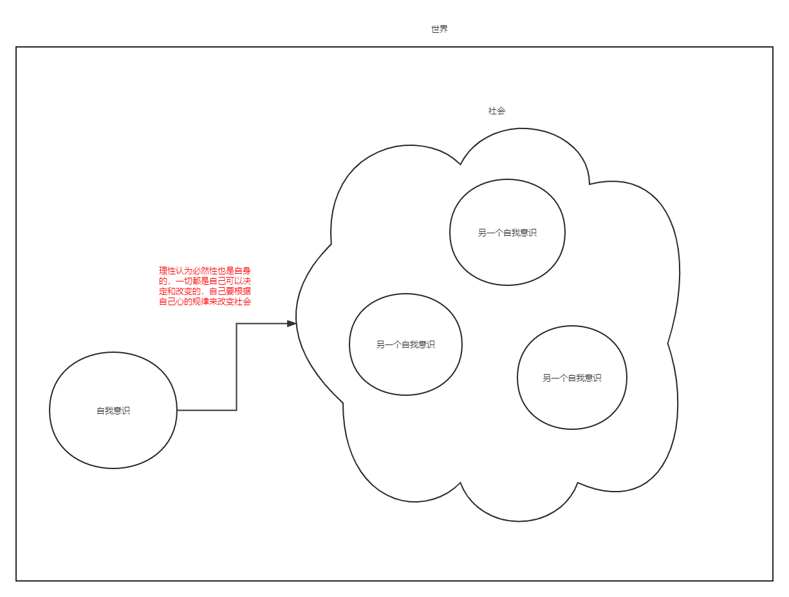

#### 心的规律和现实的规律

【心的规律】首先是尚未实现的，是理性的主观臆想。而与此相对的，则是已经在世界上运行着的【现实】。这样的现实，是个别的个体性受其压制的那一种规律，是与心的规律互相矛盾的那一种强制性的世界秩序。

自我意识于是【处心积虑要扬弃】这个与心的规律矛盾着的必然性以及必然性所带来的痛苦。理性因而不再是以前只追求个别快乐的那个形态那样轻浮粗率，而成了一种高尚目的那样的庄严诚挚，它在展示它自己的高贵本质和创造人类福利中寻找它的快乐。它追求的快乐，是一切人心的普遍快乐，而不是自己的快乐。

自我意识首先就要【改变现实，改变人类的生活】。它认为当前的运行在世界上的身和人的规律，都是假象，是应该失去力量和现实性的，要让路给自己的心的规律。

#### 将心置于现实

个体于是就实施它的心的规律。心的规律实现成了现实，在这个实现过程里获得了存在的形式，变成了普遍的势力。

在这个过程中，个体性会经验到 2 种反噬。

一、自身的异化

在这个实现的过程中，理性会经验到，【规律事实上已经脱离了心】。当心的规律变成普遍的势力之后，和理性这个个体性的心，就已经漠不相关了。例如，如果我觉得 unicode 应该重新设计，那么我提出草案，放在社会上，是一定需要人 review、judgement 的。这样，心的规律，一旦被放在社会上，就成为了一个普遍的社会事件，和我自己已经没关系了。因此，个体因而不是建立了它的规律，而仅仅是把它自身卷入于现实的秩序里去，而且它被卷入了进去的这个现实的秩序是一个对它既陌生又有敌意的高压势力。毕竟没人喜欢变化，一定会有人严厉的 judgement 你。

因此，个体就产生了一个【矛盾】：

1. 一方面，它认为当前的世界秩序是需要改变的，需要变成自己独特的心的规律；
2. 另一方面，它要想实现自己独特的心的规律，就必须承认普遍的现实，然后，自己独特的心的规律，也渐渐的变得远离、不属于自己了。

二、他人的反对

如果自己独特的心的规律【得到了保留】的话，那么【别的个体】在这个内容里找不到它们自己的心的规律，所找到的，毋宁只是一个【别人的心的规律】（即：我的规律）。

因此，每一个个体都想把自己的独特的心的规律设置为普遍的规律。这样就变成了【群雄逐鹿】的游戏。

个体当初只发现世界秩序是可厌恶的；而现在，个体发现别的人们的心本身与它的高尚意图相反，也是可厌恶的。

但是，原来那个世界秩序是僵死的，是冰冷的必然性；如今，这个世界秩序，因为是【所有人的心的规律】共同塑造的，从而变成了一个【活生生的世界秩序】。

#### 个体性的自大狂

现在，自我意识当前有了一个矛盾：自我意识的本质，是自己的独特的心的规律，但同时也是持存的、普遍的、活生生的世界秩序。

理性自身乃是它自己的这个内在的颠倒，是自我意识的疯狂。理性在崩溃的边缘，认为自己的心的规律，才是人类真正的福祉，而当前的世界秩序，则是对自己内心的一种颠倒歪曲，是某些人的阴谋。理性认为当前的世界秩序，是由狂热的传教士们、荒淫无度的暴君们以及企图通过屈辱和压迫以补偿它们自己所受到的屈辱的那些臣仆们为了致使被欺压的人类陷于无名的苦难而发明出来的。

然而，理性本身的目的，却又是把自己心的规律实现成普遍的世界秩序，而自己心的规律，却又并不是别人心的规律，在别人眼里，毋宁就是自己所鄙视的那种颠倒歪曲的世界秩序。因此疯狂的理性在这里走到了【死路】。

但是，换一个角度来看，普遍的世界秩序，就是一切心的规律，它反对一切个体性的心的规律，本身就是本质。而个体性的、独特的心的规律，则是非本质的东西。

然而，如果这样看的话，那么现成已有的那个普遍的公共秩序，只不过是大家相互之间的一种普遍的抗拒和搏斗而已，在这一团【混战】中，大家各自努力维护其自己的个别性，但大家同时又都做不到这一点，因为每个个体性都受到同一样的抗拒并相互地为别的个体性所消溶。它的内容毋宁是个别性的建立与消溶的无本质的游戏而已。这样【每个人都坚持自己的个体性的秩序混战】，叫做【世道】。

现在，自我意识在这里认识到，为了能够树立普遍的世界秩序，树立道德，而不是让普遍的世界秩序成为每个个体性的逐鹿场，就必须要【牺牲意识的个别性】；这个形态的意识，就是德行。
​
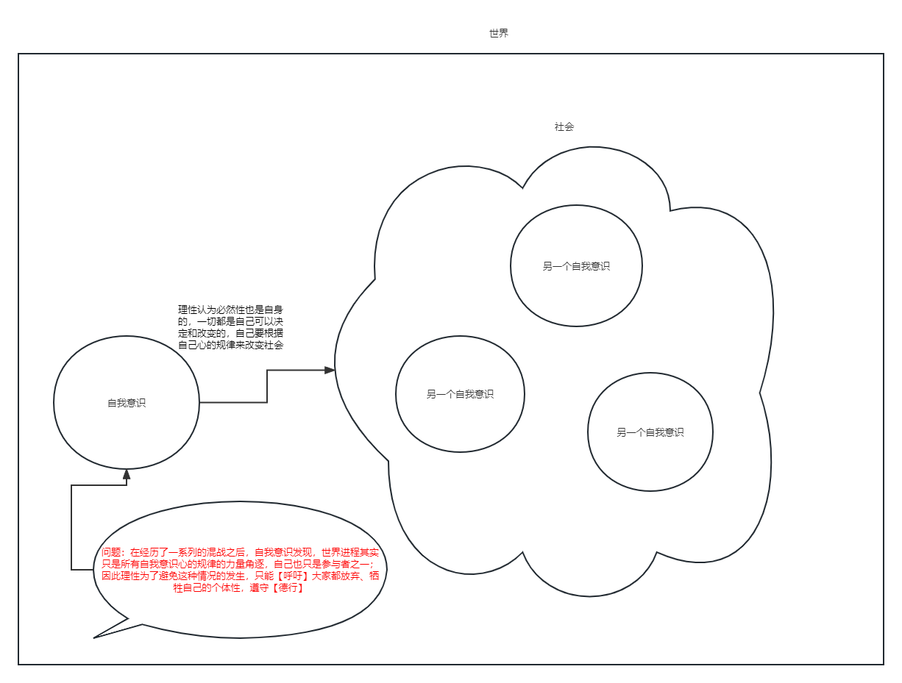

### 德行与世道

#### 自我意识与普遍的关联

德行和世道，是完全相反的运动。

1. 对于德行意识来说，规律是本质的东西，个体性是要扬弃的东西，而且既要在德行意识自身里又要在世道里予以扬弃。在德行意识那里，各人私有的个体性必须接受普遍、自在的【真与善的训练约束】。但仅仅接受训练约束，它仍然是私人的意识；只有【整个人格的牺牲、舍弃】才是真正的训练约束，才足以保证自我意识已不再执着于个别性了。通过这种个别的舍弃，个体性也就同时从世道里清除了。惟有通过个体性的扬弃，世道的本体或自在仿佛才有它自在自为地进入实际存在的行动余地。

2. 对于世道来说，个体性的态度与它在德行意识里的态度恰好相反，它现在把自己当成本质而使自在的善和真屈服于自己之下。在世道中，有两方面：一个是【寻求快乐和享受的个别的个体性】，另一个是【想要自在自为地成为规律，并且由于这种妄想而破坏着现存有效的秩序的心的规律】。

#### 世道是普遍在个体性里的现实性

德行意识还不是现实的，而只是一种信仰、潜在是真实的。德行意识想要战胜世道，取决于斗争者双方的武器性质。所谓的【武器】，就是【天赋、才能、能力】等等这些东西。在德行意识中，这些武器是被正确使用的（为了普遍的善）；而在世道中，这些武器是被错误使用的（为了自身的利益）。

既然双方的武器是一样的，那么就很难衡量德行是否能够战胜罪恶。

由于：

1. 【德行并不是真的希望正面战胜世道】。德行真正依靠的，是它相信善是自为的，【善会自动行驶它自身】。德行相信人之初性本善，相信世道会突然改邪归正。
2. 【德行它在战斗中使用的武器，本身就是它要保护的东西】（天赋、能力，这些本身都是善）。德行在世道中也会发现善（因为善本身就会自动施行）。因此德行并不能真正的大打出手。

因此，这场战斗本身，其实更像是一场【表演】。德行像是这样的一位【斗士】，他在决斗中所唯一关心的是保持其宝剑的光亮，而且德行所以要开始决斗，也正是为了要保全武器。并且，它不仅能够不使用它自己的武器，它还必须使敌人的武器也不受折损并保护敌人使其不受它自己的攻击，因为所有这一切都是它为之而奋起作战的那个善的【高贵】的部分。

因此，世道是必胜的：

1. 德行不敢大打出手。
2. 世道的个体性原则，不相信任何德行，可以扬弃一切，无所束缚。

#### 个体性是普遍的实在性

世道战胜了德行。因为事实上【德行的目的是抽象的非现实的本质】。在德行意识看来，现实是残暴的，从而臆想出来一个自己心中的、潜在的善。然而这种善，对于现实而言，是毫无撼动的。

因此，世道战胜的，其实也不是什么实在的东西，而是战胜了一些【堂皇的议论】：如什么人类的至善，什么人性的压抑，什么牺牲为善，什么误用才能，如此等等。这些都是【空话】，它们使心地高尚，使理性空疏，它们努力建设，但是毫无建树。

德行在古代，有一定的可靠含义，因为他在人民的实体中，有丰富内容作为基础，是一种现实的善。毋宁说，【在古代，德行就是世道中的主要组成部分】，因而它当时也不是旨在反对现实性。

但现在所考察的德行却与此不同，它已【脱离了实体】，它是一种【无本质的德行】，它是一种【只属于缺乏任何内容的观念和词句的德行】。那些【高谈阔论】，其实只是一些无聊的东西，空虚无物。
​
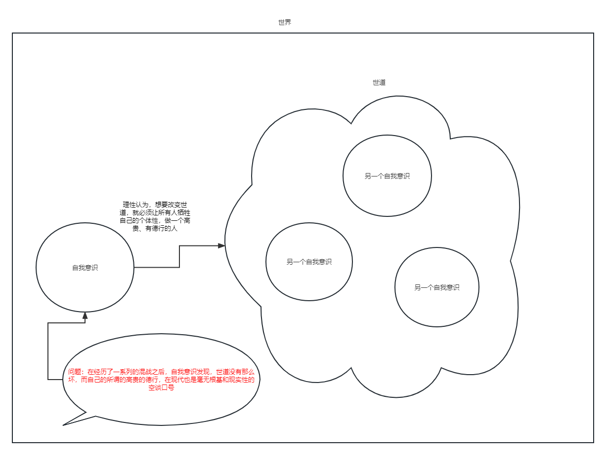

因此，理性在这一个意识形态中，经验到：

1. 世道并不象它当初看起来那样坏，世道中也有现实的善，而不必虚空臆想出来一个代表善的德行意识来讨伐世道。因为德行相信，善本来就是自动施行的，那么在世道中，本身就有善了。
2. 通过牺牲个体性以求善的显现这种办法是行不通的。个体性正就是潜在着的或普遍的东西的现实化，德行意识假设的善，已经在个体性中现实化了。

到了现在，【世道中的个体性，其实也被扬弃了】。因为世道中的个体，其实并不是单纯为了自己，而是在这个现实的社会结构中，一直实现着自己的善。世道中的个体性，可能认为自己是自私自利的，但是，正是由于他们不自觉的、自在的自私自利，对整体性的社会结构却是有意义的，整个世道因为每个人的自私自利走向了繁荣。

因此，世道和德行，此时已经成为了一个统一体——世道中的个体性，不但认识到了自己的自私自利，而且认识到了自己对集体的意义，认识到了自己的善。这种个体性，已经自为的包含了个体性的特殊与集体性的普遍的统一。意识形态迈向了下一个阶段。

## 四、自在自为的、实在的个体性

现在，理性是【自在自为】的，它不再把自己当作与直接存在着的现实相【对立】的目的，然后才设法使自己得到实现。相反，理性认为，现实的东西，现实性本身，就是和理性本身的目的是统一的，自己的个体性和世界的普遍性，已经被理性认识到，是天然统一的。

现在，理性已经认识到了自己所有的个体性行为，都具有普遍性的意义，普遍性本身就是善的，理性也就不会自大的与普遍的世界战斗。

因此，现在的理性，已经认识到了所有的限制和条件，就【专诚致力于自己】、【专心行动】。因为【自己的行动本身就是普遍性的现实】。理性的行动，只是把潜在的东西实现出来。

### 精神动物的王国和欺骗，或事情自身

理性虽然知道，自己的个体是普遍的，但是自己毕竟还是【一个个别的、特定的个体性】。所以，那个【普遍性】对它而言，【首先】是极为【抽象】的、【空洞】的范畴——它并不知道，自己的个体性是如何具体的和普遍性统一的，不知道这个过程是怎么实现的。

因此，我们就要考察一下这些具体的运动过程。

#### 个体性的概念作为实在的个体性

首先，个体性是个别的、特定的，是原始的规定性。意思就是说，个体性自己有本身的一种【限制性、规定性】，比如家庭出身，先天的身体条件，才能，能力，品质，等等。

其次，这个限制，并不能限制意识的行动，行动是可以完全摆脱自身限制的。因此，个体性本身，既能保持自己的同一（类似于观察理性中的生命那样，保持自己的同一性，吃了面包、喝了水的自己，还是自己），并且还能无限制的发展自身、实现自身，并且在实现自身的同时，也在反过来塑造自身。

再次，这里行动（否定性）和规定性（存在性）并不是对抗的关系（像心的规律、德行意识那样），而是你中有我、我中有你的关系。行动必须以规定性作为基础，而规定性在行动中会慢慢消解。

因此，现在行动（否定性）和规定性（存在性）虽然不是对抗的关系，但是毕竟有所区别。而行动的目的就在于解决这个区别。因此，行动有几个【抽象的】阶段：

1. 行动的目的、原始本质。最开始，在意识中，作为一个目的，还没有实现出来。
2. 行动的实现过程。把脑海中的目的变成现实的过程、中介、过渡。
3. 行动的结果。行动完毕之后，产物离开了行动者，成为了一个他者。

现在，理性不再在空虚的思想和目的中兜圈子，而集中于它自己的本性上（才能、能力、品质，等等原初的规定性）。

目的必须诞生于这个原初的规定性，而不能跨过自己的规定性来臆想目的，否则就是从虚无出发去追求虚无——类似于在实践理性那里，自己心中的、还未实现的目的仅仅是一种纯粹的幻想（心的规律、道德）。

现在，整个行动的几个阶段，其实是一个圆圈：

1. 目的 -> 行动。要想有行动的实现过程，必须有一个行动的目的，而这个目的唯一的内容和实在，就是行动者的原初规定性，比如才华、能力、品质等等。
2. 行动 -> 结果。行动自然会造成一个结果。
3. 结果 -> 目的。个体想要知道自己的潜在性，想要知道自己的才能几何，就必须先要通过行动的结果来认知。所以，在有目的之前，必须先采取行动。

在这个圆圈中，找不到起点究竟在哪。因此，行动不能踌躇不前，必须一头跳入这个圆圈中，开始行动。
​
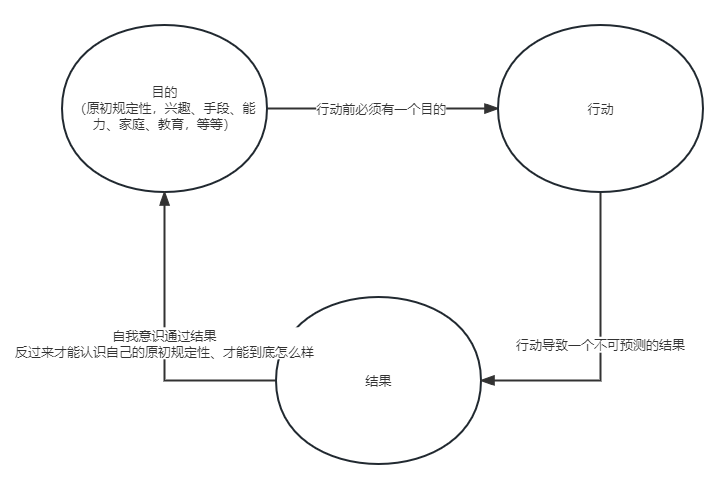

在具体行动的过程中，无论是个人的【外在环境】、【兴趣】、【手段】、【才能】、【作品】，其实都没有摆脱个体的本性和原初的规定性。外在环境就造就了原初的规定性，兴趣、手段、才能也只是原初规定性的一种体现，而作品因而最终也充满了个体的规定性。

当行动的结果——作品诞生的时候，作品和作品之间，是有着不同的个体性的本性、规定性之间的区分的。个体性的本性、规定性，成为了作品的本质。个体性也就在作品中，得到了一定程度的表现和延伸。

然而，在比较作品的时候，如果非要说出作品的【好坏】，那么也只是在说【量】的多少和好坏。这种比较是空洞的，是无聊的，是无关本质的，根本不存在天然就是坏的作品，都是根据这样无关本质的比较而比出来的。

真正有关本质，并且值得比较的是【个体性在作品中的实现环节】，而这些是不能量化的。除了这一点，作品没有其他自在的本质。

因此，除去这种对作品的虚假、空洞的比较以外，个体没有抱怨、悔恨、震怒。个体是什么，就是取决于它是怎么做的，取决于它把自己如何从可能性的黑夜变成现实性的白昼的这个过程。个体做成的事情，就是个体本身。因此，在个体意识到这一点后，个体和现实真正的达成了一体，个体实现了他的目的，个体只能感受到愉快。

#### 事情自身与个体性

现在，理性确信，自己就是一个贯穿着个体性和现实性的运动。理性完成了的作品，就是理性为自己创造出来的实在。惟有在作品里，意识才意识到个体自在地存在着时是什么情况。并且，在作品里，个体性已经不是特殊的意识，而是普遍的意识了。因为作品是公共空间的东西，被【公共化】了，是被大家一起审阅的东西，而不是潜伏在可能性中的臆想的目的。

然而，这种公共化的作品，和个体性本身形成了一种对立。在公共空间中，其他的个体来理解这个作品，势必会和生产这个作品的个体之间有本性的区别，因此它们认为的作品趣味，和创造作品的人赋予给作品的创造作品的人的本性和规定性，其实是不一样的。

然而作品的本质，就是创造作品的人赋予给作品的创造作品的人的本性和规定性。因此，作品一旦成立，一旦被放入了公共空间，一旦成为了普遍者，作品的本质就立刻会被公共空间中的其他个体解构，以至于作品消亡。

因此，自在自为的理性现在终于和上面所有的理性一样，也感受到了自己的【行动（个体性）和存在（现实性）的对立】。其实，按照我们刚才圆圈的说法就知道，行动之前的那个本性，是由行动的结果建构的。作品是自在的、现实的真理性，而在行动之前个体的本性其实只是存在于思维中的臆想，是不现实的东西。因此，理性只能从行动的现实性结果回溯性的认识到自己的本性，这个本性才是真实的。因此，个体从行动的结果，反过来认识了自己的本性。

因此，由于自己的现实性的、真正的【目的】、【手段】，都不需要从行动中回溯性的决定的，那么在最开始，理性所选择的目的和手段，都是纯粹偶然的。在没产出作品之前，它并不知道自己产出的作品是什么样子，自己的才能到底几何，自己的目的是否正当，自己的手段是否合适。这一切都十分【偶然】，能否成事全看运气。

然而，行动的偶然性，只是理性刚刚的一种感觉。理性知道，行动是必然的——因为个体的目的、能力，本身就是和现实相关的，只是自己在行动之前，不能认识到罢了。

因此，现实性的作品本身虽然是普遍者，处于公共意义空间，但是它并不自在的就是纯粹的真理。作品只是真正的真理性的一个环节。

因此，现在摆在理性面前的对象，已经不是作品了，而是【行动与存在、意愿与实行的统一体】，是【目的意愿】、【行动手段】、【现实作品】的统一。这个统一体，是【真正的作品】，是【事情】。

举例来说，《滕王阁序》是一个【作品】。“初唐的气象、王勃的出身、王勃的才气、王勃当时的心境和仕途、王勃写《滕王阁序》的原因、王勃在什么时机、喝了多少酒写的《滕王阁序》、以及最后的《滕王阁序》本身”这一整个环节，叫做一个【事情】。

在【事情】中，一切孤立的环节都被扬弃了。这样的事情，是一种【直接的精神】。这种【事情】和之前感性确定性的【物】的区别是：【物】只是为感性确定性而存在的，例如一个苹果，只是我的一个感官的对象；而【事情】虽然诞生于意识，但是它并不属于意识，是一个纯粹客观的对象。
​
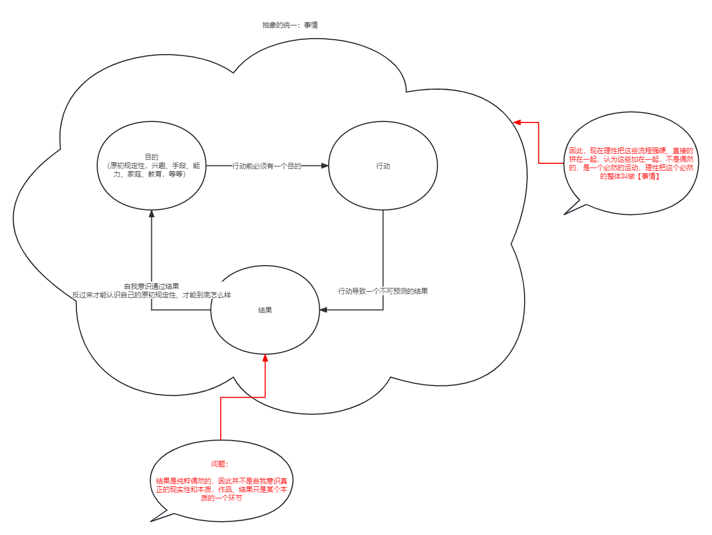

然而，这个【事情】，还只是一种【直接的统一】，是【简单的本质】。自我意识只知道目的、手段、作品，这些环节是【事情】的各个环节，但是自我意识不知道，这些环节到底是怎么统一于事情的，不知道事情如何对这些环节起作用，因此各个环节并没有从事情那里获得规定性，而还是自由的、彼此漠不相关的。比如说，理性现在还理解不了，上面说的王勃写《滕王阁序》这件事情发生的必然性到底是什么，而只是笼统的把所有环节串起来，叫做一个事情而已。

#### 相互欺骗的精神实体

然而，现在这个意识仅仅尊重【事情】，但是这个事情是抽象的，它并不知道事情到底是什么东西。因此，它总在事情自身的各个环节（目的、环境、手段、作品，等等）或种里反复【追寻】。由于意识根本不知道事情本身到底是什么东西，因此无论任何情况下，都可以用事情本身解释，并且在具体的环节中找到，总有它解释的空间。

例如：

1. 通过努力却没实现自己的目的。意识总是在这个事情的各个环节，能够找到满意的安慰。即使整个事情做的一塌糊涂，非常离谱，找不到安慰，意识也可以说：我总是做了一件事。并且意识通过这种失败，也会得到一种满足。就像品行恶劣的小年轻，想要被别人揍一顿，而且还沾沾自喜，因为自己是被揍这件事的【原因】、【目的】。
2. 什么都没做，世界就是它自己愿望出来的，世界就是由意识自己赋予的现实性。即精神胜利法。
3. 什么都没做，但是只是对某件事请感兴趣，并且可能简单的口头支持或反对一下。而事情真的按照它的想法发展的时候，它就觉得事情是由于自己支持了才成功的。

由于事情只是一个【抽象的本质】，因此自我意识总会产生怀疑，自我意识【并不知道这个事情到底在哪】。比如，当意识进行个体性、自己独特的行动时，它虽然知道这是为了事情，但是它不知道事情是什么。因此，当它说它是为了事情的时候，它也只能采取个体性的方式。因为只有个体性的东西，对它来说才是现实的。

因此，当我们考虑个体性和个体性之间的结构时，会发现，这是一场欺骗游戏：

1. 个体 A 在行动的时候，总是表现成为他的、为事情本身的。因为个体 A 本来就把事情当做本质。
2. 其他的个体也就把这个个体的行动当做是对事情本身的一种兴趣，并且以为个体 A 只是为了事情本身的实现,而事情是由哪个个体实现的，本身是毫无关系的。如果事情还没有成功，其他的个体表示可以帮忙援助个体 A，让这个事情共同实现出来。
3. 然而，个体 A 并不知道事情到底是什么，因此它其实并不是对事情感兴趣，而只是想表达自身，只是关心自己的行动和行为。
4. 其他的个体发现个体 A 的本性之后，纷纷觉得自己受骗了。
5. 然而，其他的个体赶来援助个体 A 的目的，也不是为了事情本身，也只是想表达自身，只是关心自己的行动和行为。

因此，意识在经历这些【欺骗游戏】之后，已经明白了——真正说来，事情本身，就是自己自私的行为，是和其他个体性的力量角逐的游戏。谁赢了，谁成功实现了，谁就是事情本身。
​
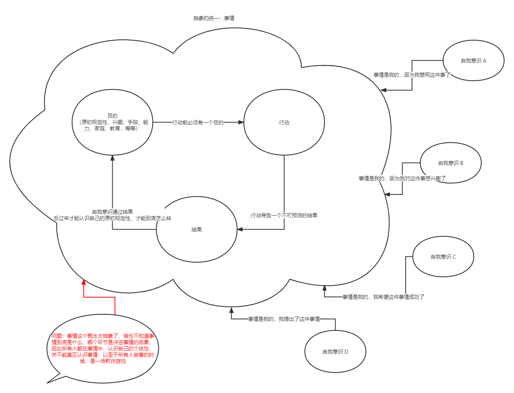

然而，这又是【不切实际】的。因为我们上面说过，个体性的作品放在公共的意义空间，依旧会【被其他人干涉】——即使这些其他人本身是为了自己。比如，豆瓣的作品评分本身是自身的一种表达，但是所有人的豆瓣评分加起来，对于这个作品就有一定的客观性可言，可以影响这个作品的资源分配、是否畅销等等现实因素。即使个体是为了自己产出作品，最后作品也一定会变成【一切人的事情】。

因此，意识经验到，个体性的行动和普遍的事情，同时都是本质。事情那个空洞的本质，现在已经被充实了：事情是每个个体的行动。此时，这个事情的本质，既是【主体】——构成事情的是世界上的每一个主体的个体性，也是【实体】——所有行动都会产生在世界的现实性中。
​
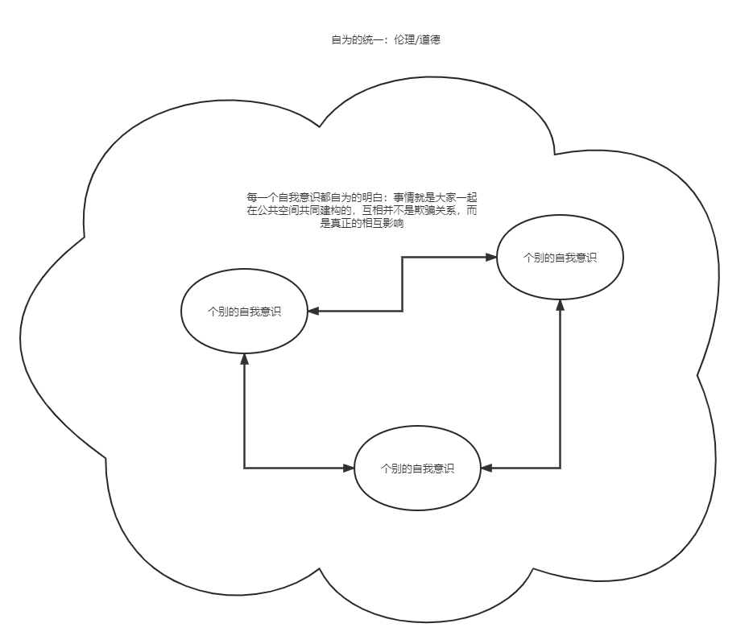

### 立法的理性

现在，个体是以事情本身作为行动的各个元素（目的、手段、作品，等等）的本质，就【不再是一个空洞抽象的说法】了。个体是以每一个个体的行动本身作为自己行动的本质。

因此，原初的那种规定性，以及在行动之前的那种目的，都被这个本质所扬弃了——也就是说，个体行动的本质并不是个体原初的规定性，例如家庭条件、出身、能力、才能，而是每一个个体的行动。

因此，每个人的行动，都考虑其他每个人的行动，每个人的行动，都是被大家一起建构的，一个人的行动就是所有人的行动，所有人的行动都是我的行动。这样，这个唯一的事情就是【自为的伦理】，或者说【道德】。

这个本质，并不再受目的、出身、能力、偶然性等诸多因素影响，而是一个【绝对】的东西。

因此，和之前实践理性不同的是，现在自我意识不愿超出这个伦理实体。因为它自己本身已经自为的以伦理实体为本质了，而不是再以个体性为本质了。

道德/伦理实体里面有很多【律令】，这些律令都是【所有个体性自为发声的】。因为是【自为的】，所以也可以叫做【道德】。现在，我们考察几条道德律令，来看看这些律令本身有什么性质。

首先，是：

1.1 “每个人都应该说真话”。

然而，这个律令本身预设了一个条件：前提是每个人都知道什么是真话。因此，这个律令实际上应该改成：

1.2 “每个人都应该按照自己对真理的掌握和理解说真话”。

这样一来，原来 1.1 这个普遍的必然性，就转化为一种 1.2 的纯粹的偶然性了。因为我说的是否是真话，全视我是否对真话有认识和是否我能对它深信无疑这个偶然事实而定。那么其实就是说，这个人到底说了真话和假话，客观上是分不清的，取决于这个人对某件偶然事情的偶然认知。

因此，这个律令的内容，或者说这个律令如果具体实现起来，是纯粹偶然的。

如果把这个“个人理解”的偶然性强行去掉，我们就只能得到：

1.3 “每个人都应该十足确信的知道真话，这样每个人也就都能说出来相关的真话”。

然而，这个律令在实际上已经无从考察了，因为一个人不可能知道全部真真话，而如果只是部分真理的话，那么这个律令首先要求一个人十足的掌握某些真理，而现在这句话已经变得毫无意义了，也是纯粹偶然的，因为每个人本来就偶然的知道一些什么，知道的是不是十足，也是纯粹偶然的，个人没法判断。

其次，是：

2.1 “爱人如爱己”。

然而，我们首先考虑：爱人不可能永远都像爱己那样，不可能给别人做到刷牙，擦脸，抠鼻子等等所有事情。因此，这句话预设了：必须知道别人的需求和痛苦，针对这些需求和痛苦来爱别人。也就是说：我必须通过理智来爱人。

因此：

2.2 “要理智的爱人”。

接下来我们考虑，如果所有的需求我们都满足，比如这个人需要学习，需要去医院，需要就业，那这种爱，其实是国家和集体给的。个人只能给很小的一部分，并且不可能包办一个人的一切需求。

因此：

2.3 “要理智的、微小的、一时的、偶然的爱人”。

那么，这样的爱人，类似于扶老奶奶过马路，帮人搬东西，等等。这都是纯粹偶然的，并且后果也不一定都是好的。

因此，这些律令，其实只停留于“应该以什么心态去做事”，只是一种没有矛盾的普遍性空话，而不是具体的“哪些时候做那些事”。这些律令没有普遍的内容，因此也就没有什么建设意义。

因此，自为的伦理/道德本质上来说自身并【不直接是一种内容】，而只是一种【尺度】，它根据是否自相矛盾来判定一种内容能否成为规律或法律。创立法律的理性，于是下降而为一种仅仅审核法律的理性。

### 审核法律的理性

伦理实体中的任何规律的【内容】，对于实体来说都是一种偶然性。即：“爱人如爱己”，那么到底该怎么爱，是完全偶然的。但是，这个“爱人如爱己”的【形式】，则是普遍的。

因此，审核法律的理性，所做的审核工作，其实就是一种对形式、对律令本身的考察。

然而，这种考察是不能深入下去的——因为不能提及偶然性的内容。举个例子：“财产私有制/公有制应该不应该无条件地成为法律呢？”

首先，财产私有制只是一种简单的制度、规定性，和公有制一样，这个概念是不会自相矛盾的。

但是，这些概念一旦继续发展/解构/分析，那么就存在矛盾了。

先说公有，有“占有意义上的”和“分配意义上的”。先说占有意义上的，那么比如生活必需品，最终一定是属于某个人，被某个人使用的，因此这些财产在概念上来说是不可能被公有的。而如果这里的公有，是一种分配意义上的共有，那么按需分配和平等分配就是永恒的矛盾。总之，具体实现的时候，共有会面临一大堆的现实泥潭问题，绝不是简单的“公有制”三个字的法律能够说清楚的。

再说私有，有“占有一个物”和“占有一个使用权”。先说占有一个物，如果我说一个物是我私有的，那么一定是一个固定的、持存的东西，是我所有的。然而对于生活必须品而言，例如水、面包，这个东西一定是被消灭掉的。那么这个物其实是没有人能够占有的。再说占有一个使用权，这个使用权是必须由别人承认的，而这个承认并不是白给的，必须纳入一些其他的法律来辅佐这个社会性的占有，例如继承、租赁，等等。
因此，我们可以看出，如果一条法律的概念进行展开，那么一定会遇到各种概念上不清晰、不准确，概念上矛盾的问题。而如果这条法律不展开，例如“私有制”、“公有制”、“伤害”、“抢劫”，只是作为一个简单的概念的话，那么是可以不矛盾的。但是这样的审核制度，适用于任何规律，比如“我们应该采取公有制”和“我们应该采取私有制”，都是不矛盾的，都是 ok 可以过审核的。那么这个时候，审核就没意义了，规律本身也没有说服力了。

因此，审核理性既不能产生一定的规律或法律，也不能得到关于法律的知识。到现在为止，无论是直接出现在自为的伦理/道德中的法律本身，还是对法律的审核，都是武断的，都是没有根据的，都是默认需要被强制服从的，都是应该被扬弃的。

因此，这种伦理实体，本身是不现实的，是强制规定的。而当这样的伦理实体被扬弃了之后，伦理实体变成了不是强制的，不是武断的，而是个体性在伦理实体上看到了自己，这样的伦理实体，就是【精神】。
​
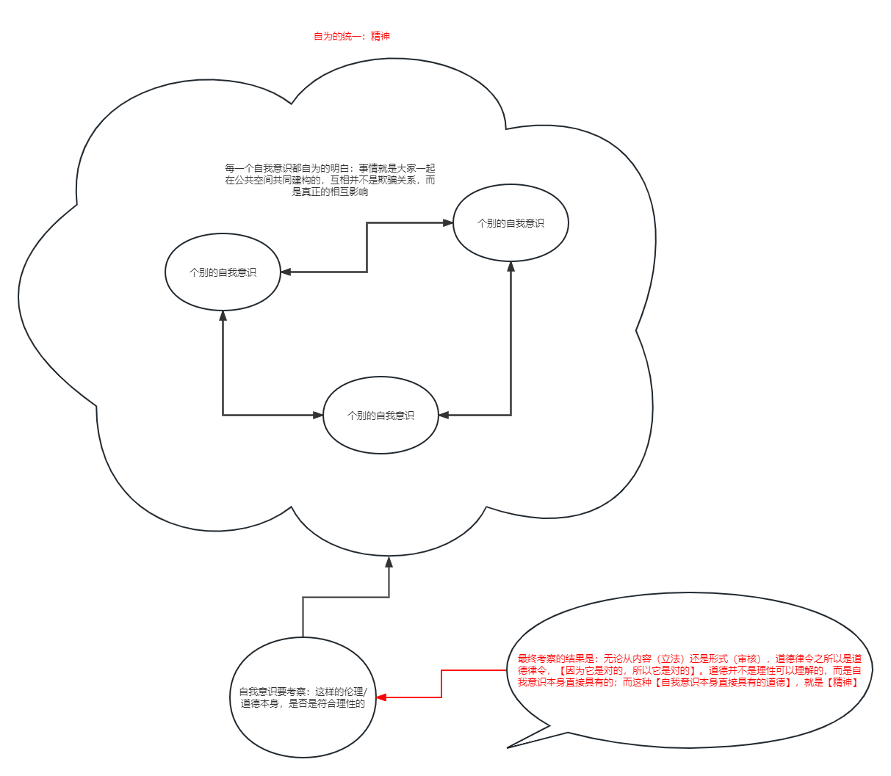

精神是：

1. 自在存在的法则。审核的那种形式的过程被扬弃了，精神是现实的，自在存在的，不容审核的，天经地义的，是每个个体性本身的自我。
2. 永恒的法则。不以某一个特定的个体意志为基础，而是超越了所有个体，是所有个体共有的纯粹意志。
3. 不是律令。律令只是“应该存在”，而精神本身就已经存在，有实际效力了，并且精神就是整个现实性。比如“人应该被当做手段”这种废话是律令，而“杀人偿命”是现实性的规律。
4. 不是主人的奴役。并不是武断的逼迫你服从，个体并没有由于这些规律而异化，而是每一个自我意识本身直接具有的思想，无论是谁，无论什么时候出生，无论在哪，精神都是绝对有效的。
5. 不是信仰。信仰是一种陌生的本质，是外来的，是个别意识永远趋赴于这个统一，而又永远达不到它自己的本质的那个运动过程（参考苦恼意识）。

因此，审核理性的这种态度，对于精神来说，是错误的。如果说它们应该得到我的意见的赞同，这就等于说我已经动摇了它们的坚定不移的自在存在，并把它们视为一种对于我也许真也许不真的东西。而精神对于个体来说，是必然成立的东西。

比如，对于“由我代人保管一项存款”这件事情来说，存款是别人的所有物，我应该好好保管，这本身就是精神的本质。然而，对于审核理性而言，可以有很多狡辩的空间——我可以把这笔款项直接据为己有。我可以直接转换我自己的观点——认为这个东西是送到我手里的，就和他送给我的礼物一样，本来就应该是我的。

然而，某些精神、伦理实体、道德，是应当的，不是因为某种论述，不是因为某种审核，而是它本来就是应当的。因为它是应当的，所以它是应当的。

自我意识所以居于伦理的实体之中，是因为【对的事情】对我来说是【自在而自为存在着的】。所以，伦理实体/道德是自我意识的本质；而自我意识则是伦理实体/道德的现实和实际存在，是它的自我和意志。
