# 《精神现象学》自我意识篇

## 一、自我意识的真理性

### 抽象的自我意识

抽象的自我意识，是书接知性章中诞生的自我意识——这是一个纯粹的规定：自我意识就是无限性，是“意识设立一个差别，然后取消了这个差别，回归了自身”。

接下来，黑格尔就要丰富“差别”的具体含义。

在抽象的自我意识中，“差别”仅仅是“抽象的差别”，是【不存在的东西】，是作为自我意识的诸环节（感性、知觉、知性），是【纯粹的意识辩证运动】。在这种【自我意识】和【纯粹的意识辩证运动】的对立中，自我意识设立了差别之后，就会立刻扬弃掉。因此，在我们看来，本质上还是没有差别的。其实，这一切都是发生在意识内部本身的运动，或者说这个被树立起来的差别其实并没有实际的内容。

在这个阶段，自我意识只是在重复的复述“我就是我”这句废话（笛卡尔：谢谢有被冒犯到）。
​
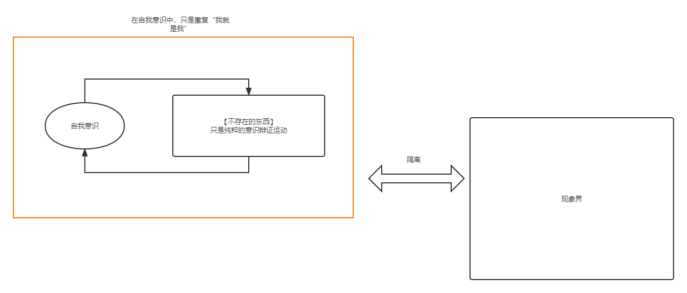

由此，在这个阶段，自我意识无法开展，无法找到其确定性，只有重复自身。那么，自我意识明白了：“差别”不能仅仅是抽象的差别，而必须是一个“存在”。这个“差别”不能是自我意识的 yy，而一定要是一个“东西”。然后自我意识去统摄它，与它一起回到统一体。

因此，这里有一个结论：

结论 4.1：自我意识的对象，如果只是【不存在的东西】，只是【作为自我意识的诸环节】，自我意识在这样的对象身上，是找不到确定性的。

### 欲望和生命二分的自我意识

至此，意识的对象，是一个【存在的东西】。并且意识要否定掉这个存在，认为这个存在和自我意识本身是没有差异的，然后回归自身的统一。自我意识在面对一个存在的时候，需要统摄它、否定它的独立性，达成自己回归统一的真理性。【欲望】就是自我意识这样主观性的取向。

以前，在自我意识只是 yy 的阶段，自我意识只是树立出来一个假的差别，然后立刻把这个假的差别统一（或者也可以理解为，自我意识只能在现象中看到自己能理解、能统摄的存在），对于这个过程而言，自我意识是有权力的、为所欲为的，它说统一就统一。

现在，我们有了一个被自我意识欲望的【存在的对象】。然而，自我意识会【经验】到：这个欲望的对象是【自己返回自身的】、【独立的】。欲望的对象不会受自我意识的“逼迫”就放弃自己的自为性、独立性。

现在，我们把意识的对象叫做【生命】。【生命】是自我意识设置出来的对立面，是一个能够返回自身的、独立存在的对象。

这里的【经验】，可以阐释为：

1. 自我意识在面对一个真正存在的时候，并没有统摄一切的权力，而是处处碰壁。
2. 自我意识在这里设立对象的时候，必须“立稳”这个对象，否则和上文只能看到自己能够统摄的虚假对象，或者立刻被消灭的虚假对象也没有了差别，而我们这里必须要和抽象的自我意识树立起一个差别。

具体如何理解，看个人的取向，不影响整体思路。

因此，在这里有一个“无限性的形式上”的二分：自我意识分裂成“自我意识”和“生命”（欲望的对象）这两面，并且自我意识希望可以通过“欲望”，能够否定生命的独立性，回归统一。
​
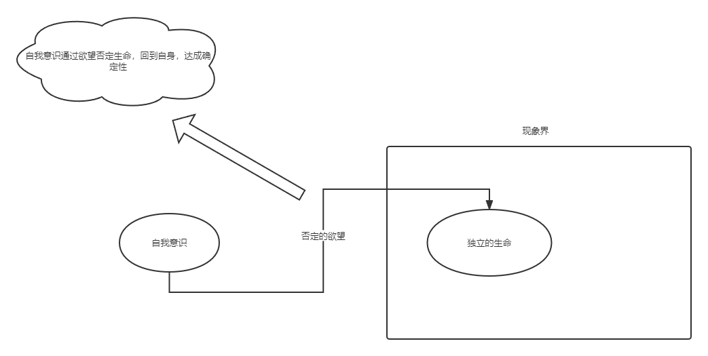

至此，我们有新的结论：

结论 4.2：自我意识的对象，如果只是【独立的生命】，而且自我意识只是通过【否定生命】来达成自己的确定性，这是做不到的。因为生命是独立的，不会任由自我意识否定。

因此，由于生命的独立性，自我意识其实在现在遇到了一个矛盾：

1. 正：自我意识必须需要否定掉对象的独立存在，这样才能维护自己的统一性。
2. 反：对象是存在的、独立的、返回自身的，是自为的，不会因为自我意识而否定掉自己。

为了让【自我意识】和【生命】没有矛盾，只有一个出路：对象（生命）需要自发地【自己否定自己】。
​
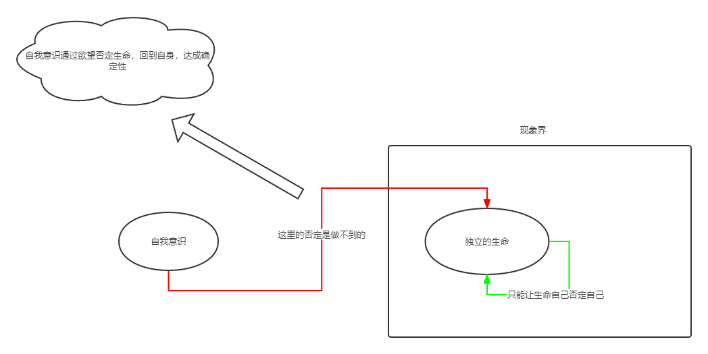

### 真正的自我意识

因此，自我意识一定要把欲望的对象（生命）设立成：这个对象（生命）可以【自发的自己否定自己】，也就是可以【反思】。因此，它就是一个【自我意识】。因为，能做到【反思】这件事的，只可能是【自我意识】。

【这一个自我意识】终于意识到了：它欲望的对象，不仅仅是【生命】，实际上是【生命的自我意识】，或者说【另一个自我意识】。也就是说，【这一个自我意识】只有把【另一个自我意识】当做对象的时候，【另一个自我意识】通过主动否定自己，才能让【这一个自我意识】达到统一性的真理。

因此，【这一个自我意识】和【另一个自我意识】最终的统一，即可达到了一种【普遍的自我意识】，或者称之为【自我意识的类】。

至此，我们有一个关于【自我意识的确定性】的结论：

结论 4.3：自我意识的对象，必须是【另一个自我意识】。【另一个自我意识】否定掉它的独立性，变成“为他存在”，认为自己的本质是【这一个自我意识】。只有这样，【这一个自我意识】才能获得确定性。

## 二、独立和非独立二分的自我意识

### 两个自我意识的相遇

此时我们的论域有两个自我意识。然而，当两个自我意识相遇的时候，它们首先都是自为的，都有否定掉对方的欲望，因此在两个自我意识之间，会发生【生死争斗】。其中一个自我意识会失去自己的独立性，成为“为他存在”；而另一个自我意识会在这个“为他存在”的自我意识中，得到自己的确定性。

现在，两个自我意识的“生死争斗”的结果是：

1. 被迫成为“为他存在”的自我意识 A。
2. 获得确定性的自我意识 B。

然而，这种【生死争斗】的结果，其实并不是消灭，并不是完全把另一个自我意识当作物来看。如果是这样的话，这个【自我意识之间的确定性】就会退化成【自我意识对物的确定性】，然而自我意识对物没有确定性，自我意识必须面对的是自我意识。因此，这种“消灭”是一种“抽象的消灭”。要保证被扬弃的自我意识是一个自我意识，不是物。

这种“自我意识 A 为了另一个自我意识 B 的确定性而放弃自己的独立性”的行为，被称作“A 对 B 的【承认】”。

此时，经历过生死斗争的两个自我意识，分别分化成【独立的意识】和【依赖的意识】。【独立的意识】是【主人】，他的本质是自为存在。【依赖的意识】是【奴隶】，他的本质是为了对方而存在。

此时的格局如图：
​
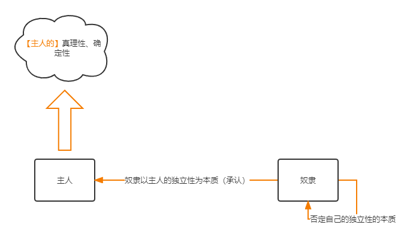

### 主人

站在主人的立场，其实有 2 个东西需要面对：奴隶、物。主人对奴隶和物，其实都是直接或间接的关联的。

此时，我们需要考虑，原来是一个意识对待物，现在变成了两个意识。那么原来对于意识而言，对物的否定性的扬弃，现在要分给奴隶。然而奴隶本身没有本质性，因此奴隶对物的扬弃，其实是为了主人。那么主人现在拿到已经非独立的物，可以直接与非独立的物统一，直接回归统一和确定性。

因此，此时的格局是：
​
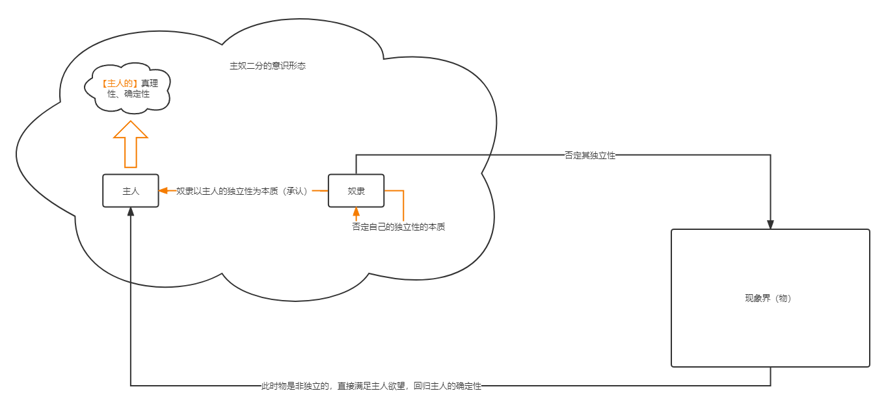

这里，在主奴二分的意识形态中，对物的态度是：

1. 【奴隶】对物的【独立性】的否定和扬弃，使得【独立的物】被【加工改造】、【劳动】成【非独立的物】。
2. 【主人】把【非独立的物】和自己直接统一的过程，被称作【享用】。

在这里，奴隶有两个面向：

1. 对于【主人】，【主人】是他的【本质】，它的一切都是依赖【主人】的。
2. 对于【物】，它通过【劳动】，消灭、否定物的【独立性】，把物【非独立性】的那一面给【主人】享用。

很明显，这种承认是片面的、不平衡的。是主人对奴隶的单方面欺凌。主人是【主要的意识】，而奴隶是【非主要的意识】。甚至，这种片面的承认，会走向其反面。我们考虑一个基本的矛盾：主人实际上想要达到真理性，是依赖奴隶的。这是一种【反向依赖】。

所以，主人其实本质上不是一个独立意识。那么，成为独立意识的，只能是奴隶。因此，我们得到一个结论：

结论 4.4：主人客观上是依赖奴隶的，因此主人自身其实并不是自为存在，仍然是为他的，在主人身上是没有确定性的。

### 奴隶

首先，对于奴隶来说，主人是本质。然而，上面说，奴隶其实应该是独立意识，那么奴隶该怎么发展成独立意识呢？

首先，我们可以意识到奴隶具有：

一、持久性。

1. 主人的【享用】，是欲望的完全体，主人对欲望的满足其实是随即消逝的，因为它缺少那客观的一面或持久的实质的一面。
2. 奴隶的【劳动】，是受到限制或节制的欲望，亦即延迟了的满足的消逝。对于对象的否定关系成为对象的形式并且成为一种有持久性的东西，这正因为对象对于那劳动者来说是有独立性的。

在奴隶的角度，对物的否定，本身就代表着自己的意识是有否定性的，是自为的。奴隶通过消灭物的独立性，天然的外化自己，表现自己的能力。那【劳动着的意识】便达到了以独立存在为自己本身的直观。

二、恐惧与形式。

首先，奴隶在“生死斗争”中，经验过对独立性、对主人的恐惧。由于对独立性的斗争的恐惧，自己放弃了【独立性】，成为了为主人存在的【物性】。因此，奴隶成为完全的“为他存在”。在奴隶进行劳动的时候，它的目的完全是服侍主人，而不是表现自己。

然而，奴隶在物面前，通过陶冶，在否定了物的独立性的同时，把自己的形式带给了物，让物不在是“自为存在”，而变成了“为奴隶存在”。在这个过程中，【奴隶通过对物的独立性的否定，反而肯定了自己的独立性】。从这个角度来看，奴隶意识到了自己的独立性，奴隶重新发现了自己。

因此，奴隶通过劳动，找回了自己的一些独立性，认识到自己并不是完全的物性，克服了恐惧。奴隶明白了自己并不是主人的工具，自己并不是一个执行的木偶，自己是有一定的自主性的。因此，在奴隶身上，我们发现了一种最初的【自由】。只是这种自由，还停留在奴隶的处境之内，奴隶对物的存粹形式上的赋予，还没有成为奴隶的本质，奴隶的本质仍然是主人的独立性。

至此，我们可以得到一个主奴辩证法阶段的结论：

结论 4.5：在【主人意识】和【奴隶意识】身上，其实都没有【自我意识的确定性】。主人仅仅是依赖了奴隶去享受物；奴隶虽然能够在劳动中察觉到自身的独立性，获得初步的【自由】，但他的本质还是依赖于主人。

## 三、自由的自我意识

### 斯多葛主义

现在，在我们看来，在奴隶那一侧，已经获得了初步的自由，然而并不是完全的自由，奴隶意识还应该意识到以下两点：

1. 【否定主人】：奴隶意识的本质，并不是主人的独立性，而是自身内在的。
2. 【提升形式】：奴隶意识的本质，其实就是在劳动中，给物赋予的自身的【纯粹形式】。

奴隶在【否定主人】和【提升形式】这两个变化之后，奴隶意识摆脱了主人的限制，来到了无限性。

现在，自我意识在对象身上看到的只是自身，它只能看见自我意识本身具有的【纯粹形式】。此时，意识的对象，并不是表象，而是【概念】，是意识的建构物，是【自我意识和物之间中介的形式】，是【纯粹的思想】。

因此，在自我意识看来：【对象是被意识的规定的】，这个【规定的过程】就叫做【思维】。这种【把思维作为意识的本质】的意识形态，我们称之为【斯多葛主义】。

因此，在斯多葛主义中：

1. 只有【自我意识思想内的差别】、【纯粹形式】、【思维】，被认为是有实在性的。
2. 【特定事物】、【特定的自然存在的意识】、【对特定事物和自然存在的情感、欲望或目的】，都没有实在性。

此时我们的格局如下：
​
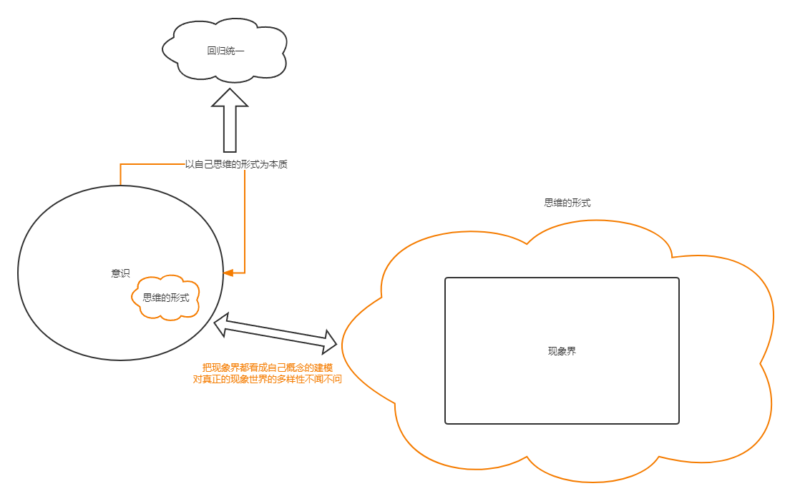

然而，在斯多葛主义中，自我意识认识到的本质，只是一个【抽象的本质】，是【空洞的】。斯多葛主义只以【纯粹思想】为它的真理，而纯粹思想是没有生活的充实内容的，因而也只是自由的【概念】，并不是活生生的自由本身。作为本质的思想，其实这只是一种【抽象的形式】，是【概念】，它脱离了独立存在的事物。但是概念在这里既然是抽象的，它就脱离了事物的多样性，它本身内就没有内容，而只有一个被给予的内容。

因此斯多葛主义对于回答什么是一般真理的标准、什么是思维、形式、概念本身的内容这一问题时，就处于困惑的境地。因为它本质上来说是没有内容的，只有【纯粹形式】。因此，它只知道自己的思维框架中存在【真理】这个概念，但是它不知道这个概念该【具体展开成什么】。

因此，斯多葛主义，因为它本身具有【抽象的自由】这一特质，脱离了有限存在而仅仅退回到自身，不曾在自身内完成了对有限存在的绝对否定，而【只是从有限存在中看到了符合自己思想和纯粹形式的那一面】，带有一种【特定性】或【局限性】。

因此我们有结论：

结论 4.6：在【斯多葛主义】中，我们得到的确定性是抽象的、空洞的、有局限性的。斯多葛主义的对象，只是脱离了现实的纯粹形式，没有任何内容。因此，斯多葛主义并没有实质上的确定性。

### 怀疑主义

我们刚刚是站在【概念】、【纯粹形式】的角度上来考虑的斯多葛主义。斯多葛主义对于这个自由的概念只是当做一个概念，【没有实质性的开展】。

就其本质而言，【斯多葛主义对现实世界只提取思维概念这一方面，对物本身是视而不见的】。因此，斯多葛主义也就是纯粹形式，没有任何内容。

现在，作为斯多葛主义的【另一面】，我们需要来看看这个意识形态【在现实经验中】，会有如何的开展。

斯多葛主义，在【现实世界】的【经验】中的【实现】和【展开】，我们叫做【怀疑主义】。

首先，对于物的方面：怀疑主义把【自我意识自身的纯粹形式】、【思维】当做【真理性】。与此相对的，那些与它有差别的种种【独立事物】，都只是【行将消逝的东西】，都【没有真理性】。

其次，对于自我意识本身：由感性确定性、知觉到知性的辩证运动中，以及本章的主奴辩证中，意识本身到达的确定性，包括什么共相、力、无限性，其实也都没有确定性。

【怀疑主义】不仅仅【不相信客观事物本身】，而且【不相信自我意识能够认识客观事物】。

怀疑主义认为，任何被规定的东西，都预设了一个更高一层次的、更 meta 的【规定性】的本质，意味着受制于它物——【限定即否定】。对于怀疑主义来说，只有一点是确定的，那就是【思维的绝对否定性】，这是怀疑主义的自我意识的本质，是一种【自由的确定性】。

因此，怀疑主义的格局是这样的：
​
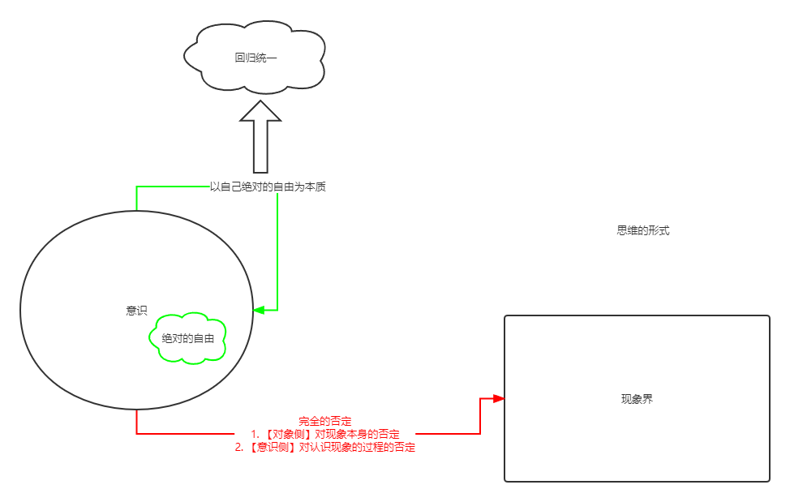

然而，这种自由的确定性，其实只是一种【感觉和思维的表象的混合体】。因为客观的来看，【怀疑主义它只能看见现象】。怀疑主义在【日常经验】中，也承认自己的意识也是【偶然的】、【独立的】。

因此，怀疑主义有这样的矛盾：

1. 怀疑主义承认自己是本身是【偶然的、特殊的、受限的意识】，并且自己身边的所有现实世界其实都是纯粹偶然的、特殊的、受限的。【个别的自我意识】实际上【囿于】这样的现实世界。
2. 怀疑主义坚信自己意识到了自我意识中存在【必然的、非规定的、自由的本质】，认为自我意识中存在真理性。【自由的自我意识】可以【超越】这样的现实世界。

因此，怀疑主义总是【在这个矛盾中摇摆】：

1. 怀疑主义宣称所看见、所听见的东西不存在；然而它自己本身却看见了、听见了。
2. 怀疑主义宣称伦理原则不存在；然而它自己却仍然把这些伦理原则当作支配它的行为的力量。

怀疑主义在这个意识形态下，只会进行【诡辩】。它所说的话事实上就好象顽皮任性的小孩子的吵闹，一个说甲，另一个就说乙，一个说乙，另一个就说甲，而他们通过这样的【互相反对争辩】，借以获得彼此处于矛盾争辩状态中的、【绝对否定性的乐趣】。

因此，怀疑主义的格局其实是这样的：
​
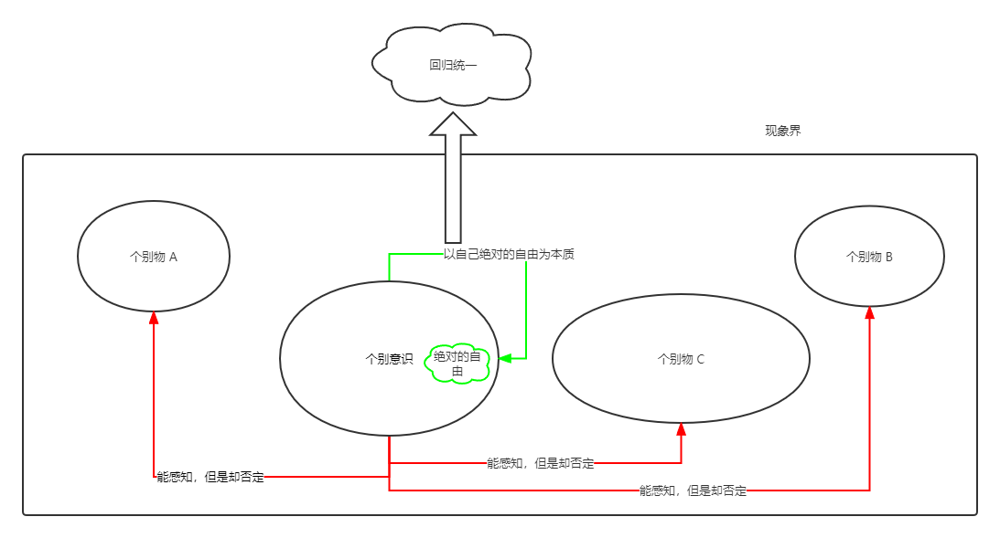

然而，在怀疑主义里，自我意识其实已经经验到它自己是一个【自身矛盾着的意识】。从这种经验出发，它又进展到一个【新的意识形态】，这个新的形态把怀疑主义分离开了的两个思想【结合】起来了。

### 苦恼意识

现在，自我意识已经认识到，在怀疑主义中的那种【矛盾性】。它承认两方面都是实在的，自己被困在两个方面的【夹缝】中。

因此，它是一个【双重的意识】：

1. 首先，自我意识是【自己解放自己的、不变的、自由的意识】。
2. 其次，自我意识是【绝对自身紊乱的、错乱的、受限的意识】。

然而，虽然自我意识能够确信自己的两方面都存在，他现在还没有能力统一。

因此，自我意识目前只是单纯的认为，【单纯不变的那方面】为【本质】，而【杂多变化那方面】为【非本质】。其中，【本质】的一方面，我们以下也会称之为【上帝】。首先，自我意识本身就是【沉沦】在【单纯不变的那方面】。因此它需要把自己解救出来，从变化的一面【飞升】到不变的一面。

这种【认识到自我意识有自由、受限两方面矛盾】的意识形态为【苦恼意识】。

真正说来，【苦恼意识】所苦恼的，所要解决的矛盾，其实就是【个别性】和【自由】的【统一】。【苦恼意识】最开始诞生的时候，并不能把两者统一起来。

【苦恼意识】想要统一，进路大致可以分成【纯粹的意识】、【欲望与劳动】、【自我意识返回自身】这三个阶段。

#### 纯粹的意识

最开始，自我意识仅仅认为，【单纯不变的那方面】、【上帝】和自己身边的【现实世界中的物】是一样的，具有【个别性】、【消逝性】，是一缕浮光。然而，它和身边的那些实物又不太一样，而是自我意识【无法到达】、【无法触及】的【彼岸】。

此时的【统一的形式】，其实是：【自由】以【个别性】为自己的【形式】。

然而，这里有两个设定上的矛盾：

1. 这个【彼岸】，在自我意识看来，【本身就是不可到达的】。那么，自我意识多靠近一点，彼岸就离自己远一点，当你达到时，它已经飞离开了。自我意识永远都抓不到这个不变的个别性。
2. 个别性的物，由于是个别性的，因此它本质上和身边的物一样，具有【消逝性】、【偶然性】，消逝性带来【死亡】，偶然性带来【不知道在哪能遇见】。由此，这个个别的就更不可能抓住了。
​
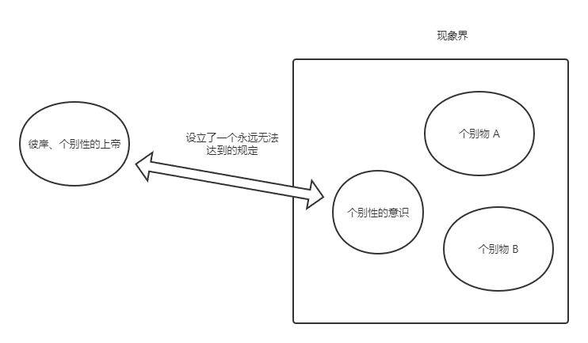

这里，我们到一个结论：

结论 4.7：【自由】以【个别性】设定为自己的【形式】，以此达成的【个别性的自由】，或者说【个别性的上帝】，这种上帝是【不可达】的，存在【设定上的的矛盾】。

#### 欲望与劳动

以上，自我意识已经知道，把【个别性】直接设置为【自由】的形式，其实是矛盾的。现在，自我意识要把【普遍的个别性】赋予成【自由】的形式。

此时的【统一的形式】，其实是：【自由】以【普遍的个别性】为自己的【形式】。

也就是说，自我意识认为：整个现实世界的【所有个体物】，其实【都】是上帝的形态。上帝就是这些【普遍的个别性】。并且，【自我意识】其实也是个别性的，因此【也是上帝赋予的】。

那么，我们站在这个立场，重新考虑我们之前说的，自我意识对待【所有个体物】的态度，即【劳动和欲望】。

在【劳动和欲望】中，并不是自己的独立性扬弃了物的独立性，是彼岸自己扬弃了自己。这个过程，只是借助当前的现实世界来显现。

因此，自我意识此时【放弃自己的独立性】，并且认为【自我意识的本质是彼岸赋予的】。在这个过程中，意识与不变的本质确实达成了【暂时的统一】。
​
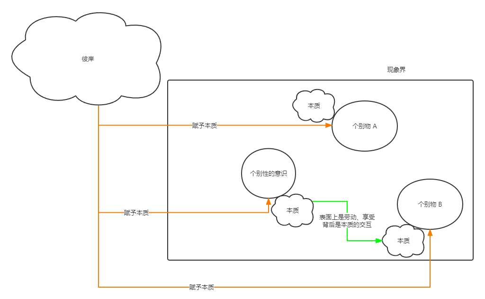

然而，这种统一背后仍然有更深层的【分裂】：

1. 首先，意识在【表面上】诚然不承认它的自我情绪的满足，但是它【实际上】确实获得了自我情绪的真实满足。自我意识嘴上说着是为了上帝，但是【客观的】来看，它确实本人劳动过、享受过。
2. 其次，自我意识【对本质的扬弃】，认为【上帝给自己带来了本质】，真正说来其实也是它【自己特有的行动】。
​
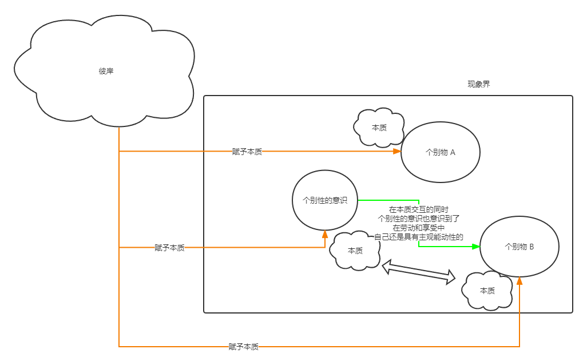

因此，我们有结论：

结论 4.8：在欲望和劳动中完全认为自己的本质是上帝赋予的，是行不通的。自我意识本来就有独立性、能动性。

#### 自我意识返回自身

此时，意识经验到自己是现实的并起着作用的意识，是【自在自为的】、【真实】的自我意识。因此并不能再【自欺欺人】，沐浴在【神圣化的世界】之中了。

此时的【统一的形式】，其实是：【个别性的自我意识】认为自己【本质】就是【自由】的。

然而，虽然自我意识了解到自己的现实性，它也同样意识到自己首先是【虚幻不实】的。自我意识的独立性，其实是诞生在【动物性的劳动】中。因为，和彼岸意识相比，自我意识在现实中，主动的去做的，其实是最特别的、最卑贱的劳动。自我意识每天做的劳动，其实真正说来就是每天的洗衣刷牙开车上机床下海打渔。

因此，自我意识想到了这一层，就会局限在自己狭隘的自我和琐屑的行动中。自我意识忧虑着自己【不幸、贫乏、可怜的处境】。

由于这个【苦恼意识】认识到自己【不幸、贫乏、可怜的处境】，它在现实中，感觉到的【自由】，和【彼岸】的自由，完全是两回事，根本不是一个格局，【此岸就是一个泥潭】。因此，自我意识也就无法连接到【彼岸】。因此，这个【苦恼意识】必须【设置】一个【中介】（教会），这个中介来沟通【不幸、贫乏、可怜的自己】和【彼岸】。

有了这个中介，自我意识就可以【抛弃自己的本质】、【抛弃自己的自为存在】，【把自己的独立性和自由，交个这个中介决定】。

自我意识放弃的有：

1. 放弃【本质】、【独立性】，对中介【言听计从】。
2. 放弃【享受】，进行【苦行】。
3. 放弃【劳动成果】，进行【捐献】。

只有通过这种真实的【自我牺牲】，自我意识才能保证【对自身的否定与弃绝】。

在这种实际的完成了的牺牲里，自我意识一方面【扬弃了它个别的独特的行动】，但另一方面，自我意识也就自在地【消除了苦恼】。

然而，其实这只是自我意识【自欺欺人】：

1. 首先，并没有放弃全部【财产】，也没有进行绝对 24h 的、100% 的【苦行】，而是把捐财产这件事当做一个【安慰】。其实，自我意识【不是真心实意的觉得自己的劳动和享受都是被上帝支配，不是自己做的】。
2. 另外，它所做的【决定】，包括放弃本质、捐赠、苦行等等，根本上说来也都是自我意识【自己选择的，是自己对自己的规定】。
​
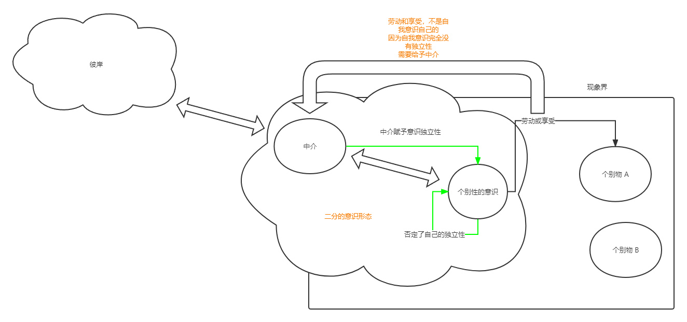

因此，这里有一个结论：

结论 4.9：在【以中介为交互的】、【自我物化】的【自欺欺人】过程中，自我意识也肯定到达不了彼岸。

然而，因为【苦恼意识】已经明白了【自己的个别存在有一定的独立性】，只是设置了一个中介，然后放弃了自己的独立性，或者说认为自己并不是那个中介。因此，这里也就出现了【理性】的苗头。

当自我意识明白：个别意识是绝对的自在存在，是一切实在，根本不存在彼岸，或者说自己的个别意识就完全等同于彼岸，此时，意识就达到了【理性】。
